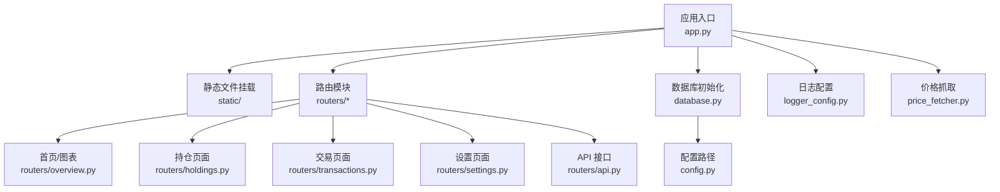
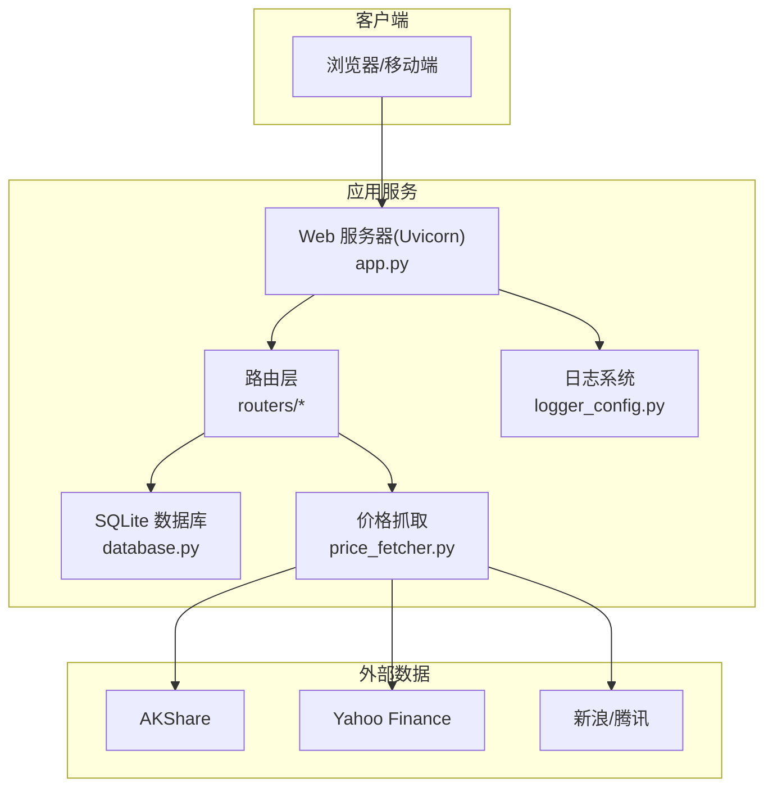
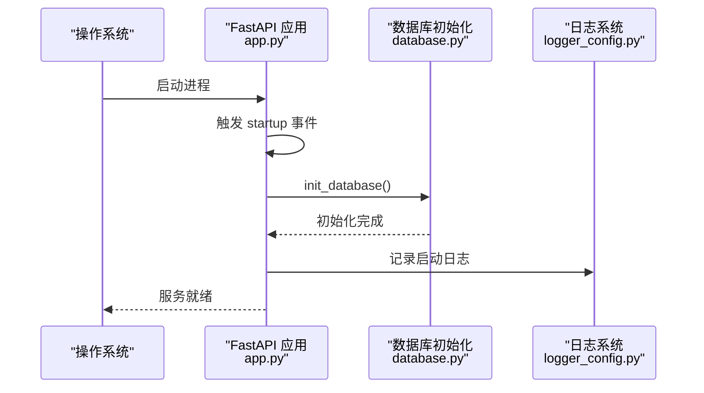
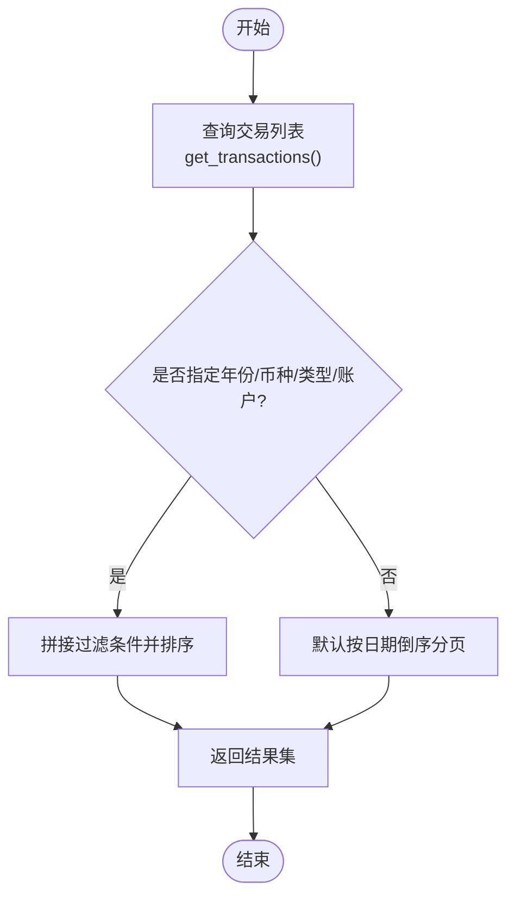
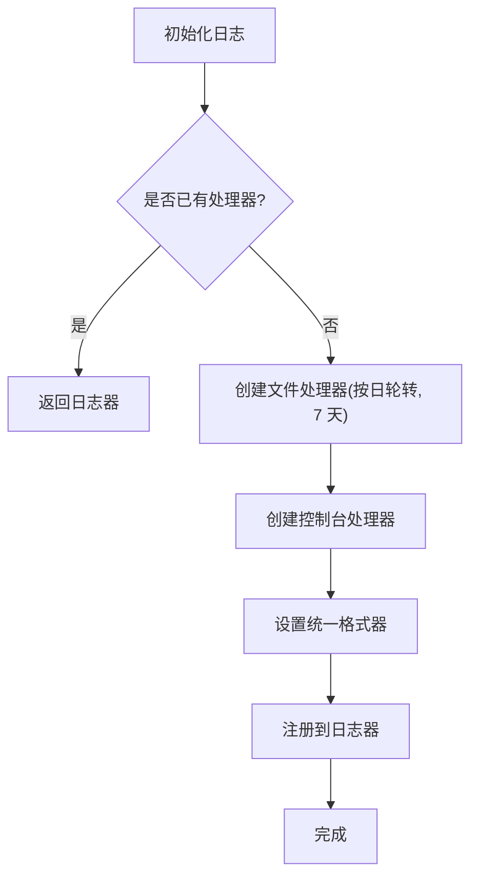
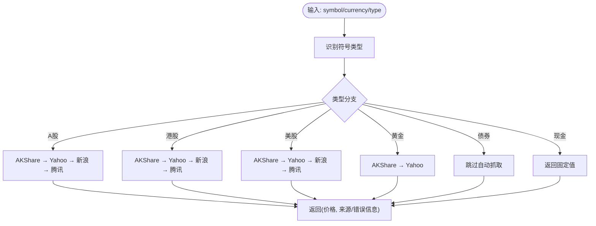
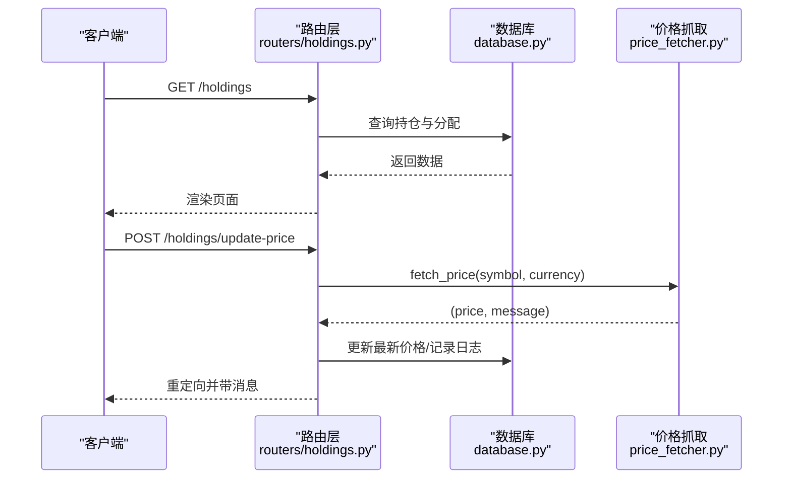
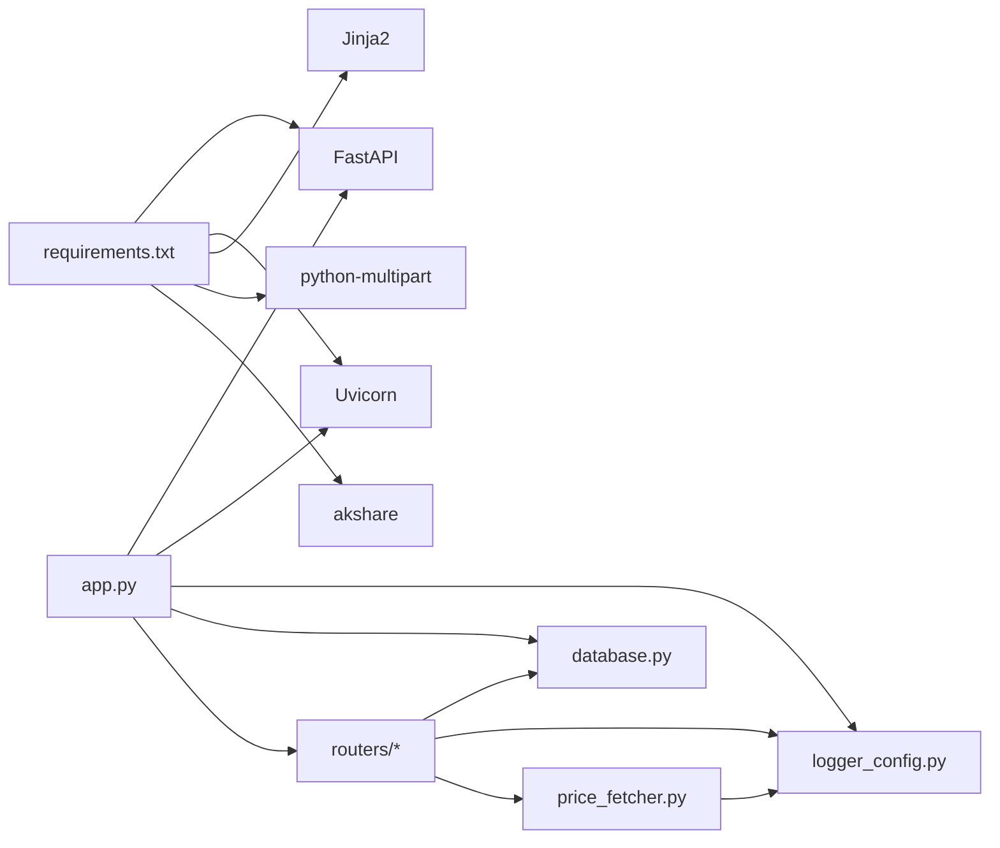

# 部署与运维

<cite>
**本文引用的文件**   
- [app.py](file://app.py)
- [config.py](file://config.py)
- [database.py](file://database.py)
- [logger_config.py](file://logger_config.py)
- [requirements.txt](file://requirements.txt)
- [price_fetcher.py](file://price_fetcher.py)
- [routers/api.py](file://routers/api.py)
- [routers/holdings.py](file://routers/holdings.py)
- [routers/transactions.py](file://routers/transactions.py)
- [routers/overview.py](file://routers/overview.py)
- [routers/settings.py](file://routers/settings.py)
- [routers/utils.py](file://routers/utils.py)
- [templates/base.html](file://templates/base.html)
- [.gitignore](file://.gitignore)
</cite>

## 目录
1. [简介](#简介)
2. [项目结构](#项目结构)
3. [核心组件](#核心组件)
4. [架构总览](#架构总览)
5. [详细组件分析](#详细组件分析)
6. [依赖关系分析](#依赖关系分析)
7. [性能考量](#性能考量)
8. [运维部署指南](#运维部署指南)
9. [容器化与云平台最佳实践](#容器化与云平台最佳实践)
10. [故障排除指南](#故障排除指南)
11. [结论](#结论)
12. [附录](#附录)

## 简介
本指南面向投资日志管理系统的生产环境部署与运维，覆盖服务器环境准备、依赖安装、应用启动配置、Uvicorn ASGI 服务器配置与进程管理、负载均衡策略、数据库备份与迁移、版本升级流程、日志与监控、性能调优、容器化与云平台部署、自动化脚本与告警配置示例以及常见问题排查与应急响应。

## 项目结构
系统采用 FastAPI + Jinja2 模板的单体应用，静态资源通过挂载目录提供，数据库为本地 SQLite 文件，日志按天轮转并保留 7 天。路由模块按功能拆分，API 路由提供后端接口，页面路由提供网页界面。

**图示来源**
- [app.py](file://app.py#L13-L29)
- [routers/overview.py](file://routers/overview.py#L8-L17)
- [routers/holdings.py](file://routers/holdings.py#L13-L30)
- [routers/transactions.py](file://routers/transactions.py#L10-L28)
- [routers/settings.py](file://routers/settings.py#L11-L21)
- [routers/api.py](file://routers/api.py#L6-L31)
- [database.py](file://database.py#L22-L151)
- [config.py](file://config.py#L17-L24)
- [logger_config.py](file://logger_config.py#L14-L50)
- [price_fetcher.py](file://price_fetcher.py#L36-L66)

**章节来源**
- [app.py](file://app.py#L13-L29)
- [templates/base.html](file://templates/base.html#L1-L27)

## 核心组件
- 应用入口与生命周期：应用在启动事件中初始化数据库；开发模式下可直接以 Uvicorn 运行。
- 数据库层：集中初始化表结构、索引与默认资产类型；提供交易、账户、符号、分配设置、操作日志、最新价格等读写接口。
- 日志系统：按天轮转，保留 7 天日志，同时输出到控制台。
- 价格抓取：多数据源回退策略，支持 A 股、港股、美股、黄金等。
- 路由与模板：首页概览、持仓详情、交易录入、设置、API 接口，配合 Jinja2 模板渲染。

**章节来源**
- [app.py](file://app.py#L18-L22)
- [database.py](file://database.py#L22-L151)
- [logger_config.py](file://logger_config.py#L14-L50)
- [price_fetcher.py](file://price_fetcher.py#L36-L66)
- [routers/api.py](file://routers/api.py#L6-L31)

## 架构总览
系统为单实例 Web 应用，前端通过浏览器访问，后端提供 REST API 与页面路由。数据库位于应用所在主机的本地文件系统，日志落盘于应用工作目录。

**图示来源**
- [app.py](file://app.py#L31-L33)
- [routers/api.py](file://routers/api.py#L6-L31)
- [database.py](file://database.py#L22-L151)
- [logger_config.py](file://logger_config.py#L14-L50)
- [price_fetcher.py](file://price_fetcher.py#L22-L34)

## 详细组件分析

### 应用入口与生命周期
- 启动事件：在应用启动时初始化数据库，确保表结构、索引与默认资产类型存在。
- 开发运行：直接使用 Uvicorn 在本地回环地址监听，便于调试。

**图示来源**
- [app.py](file://app.py#L18-L22)
- [database.py](file://database.py#L22-L151)
- [logger_config.py](file://logger_config.py#L14-L50)

**章节来源**
- [app.py](file://app.py#L18-L22)

### 数据库层设计与事务处理
- 表结构：交易、账户、符号、分配设置、资产类型、操作日志、最新价格。
- 索引：对 symbol、date、account、type、currency、asset_type 建立索引，提升查询效率。
- 事务 CRUD：提供新增、查询、更新（含字段白名单与金额重算）、删除等接口。
- 持仓计算：按 symbol、account、currency、asset_type 分组统计，结合最新价格计算市值与未实现损益。
- 价格联动：买入/卖出可联动记录现金交易，保证资金流一致。

**图示来源**
- [database.py](file://database.py#L294-L341)

**章节来源**
- [database.py](file://database.py#L22-L151)
- [database.py](file://database.py#L294-L341)
- [database.py](file://database.py#L344-L390)
- [database.py](file://database.py#L393-L463)

### 日志系统与轮转策略
- 日志目录：应用根目录下的 logs 子目录。
- 轮转规则：按午夜轮换，保留 7 天备份。
- 输出目标：文件与控制台双通道，格式包含时间、名称、级别与消息。

**图示来源**
- [logger_config.py](file://logger_config.py#L14-L50)

**章节来源**
- [logger_config.py](file://logger_config.py#L14-L50)
- [.gitignore](file://.gitignore#L1)

### 价格抓取与多源回退
- 符号类型识别：根据币种与格式判断 A 股、港股、美股、黄金、债券、现金等。
- 回退顺序：AKShare → Yahoo Finance → 新浪 → 腾讯。
- 错误记录：各源异常会记录调试日志，最终汇总失败原因。

**图示来源**
- [price_fetcher.py](file://price_fetcher.py#L36-L66)
- [price_fetcher.py](file://price_fetcher.py#L325-L401)

**章节来源**
- [price_fetcher.py](file://price_fetcher.py#L36-L66)
- [price_fetcher.py](file://price_fetcher.py#L325-L401)

### 路由与页面交互
- 首页与图表：展示按币种分组的资产配置与未实现损益。
- 持仓详情：按符号查看交易历史、支持手动/自动价格更新、快速交易。
- 交易录入：支持多币种、多资产类型、佣金与资金联动。
- 设置：分配区间、账户与资产类型管理。

**图示来源**
- [routers/holdings.py](file://routers/holdings.py#L13-L30)
- [routers/holdings.py](file://routers/holdings.py#L102-L147)
- [database.py](file://database.py#L393-L463)
- [price_fetcher.py](file://price_fetcher.py#L325-L401)

**章节来源**
- [routers/overview.py](file://routers/overview.py#L8-L17)
- [routers/holdings.py](file://routers/holdings.py#L13-L30)
- [routers/holdings.py](file://routers/holdings.py#L102-L147)
- [routers/transactions.py](file://routers/transactions.py#L10-L28)
- [routers/settings.py](file://routers/settings.py#L11-L21)

## 依赖关系分析
- 应用依赖：FastAPI、Uvicorn、Jinja2、python-multipart、akshare。
- 运行时依赖：Python 标准库（logging、sqlite3、pathlib、urllib 等）。
- 组件耦合：路由层依赖数据库模块；API 路由与页面路由共享数据库接口；价格抓取模块独立但被页面路由调用。

**图示来源**
- [requirements.txt](file://requirements.txt#L1-L6)
- [app.py](file://app.py#L7-L11)
- [routers/api.py](file://routers/api.py#L1-L4)
- [price_fetcher.py](file://price_fetcher.py#L22-L34)

**章节来源**
- [requirements.txt](file://requirements.txt#L1-L6)
- [app.py](file://app.py#L7-L11)

## 性能考量
- 数据库层面
  - 已建立多列索引，建议定期检查执行计划，避免全表扫描。
  - 对高频查询（如按日期范围、账户、类型）保持索引有效性。
- 应用层面
  - 页面分页（每页 100 条）降低一次性传输量。
  - 价格抓取为异步 IO 密集型，建议限制并发请求或增加缓存窗口。
- 日志层面
  - 按天轮转减少单文件体积，注意磁盘空间与 inode 使用。
- 网络与外部依赖
  - 多源回退策略提高可用性，需关注各源限流与稳定性。

[本节为通用指导，无需具体文件引用]

## 运维部署指南

### 生产环境部署步骤
- 服务器环境准备
  - 操作系统：Linux（推荐 Ubuntu/Debian/CentOS）。
  - Python 版本：满足 requirements.txt 中 FastAPI 的最低版本要求。
  - 系统依赖：无特殊系统库，确保网络可访问外部数据源。
- 依赖安装
  - 安装 Python 依赖：使用 pip 安装 requirements.txt 中的包。
  - 可选：安装系统级网络工具以便诊断。
- 应用启动配置
  - 数据库路径：默认存储于用户 iCloud 目录，可在生产环境中通过环境变量覆盖。
  - 日志目录：应用根目录下 logs，确保写权限。
  - 静态资源：static 目录随应用一起部署。
- 启动方式
  - 开发：直接运行主程序以 Uvicorn 启动。
  - 生产：建议使用进程管理器（如 systemd 或 supervisor）守护进程，并结合反向代理（Nginx/Traefik）暴露服务。

**章节来源**
- [config.py](file://config.py#L17-L24)
- [logger_config.py](file://logger_config.py#L11-L12)
- [app.py](file://app.py#L31-L33)

### Uvicorn ASGI 服务器配置与进程管理
- 基本参数
  - 主机与端口：生产环境建议绑定内网或仅本地回环，通过反向代理对外暴露。
  - 工作进程数：单实例应用通常无需多进程；若启用多进程，注意 SQLite 的并发写入限制。
- 进程管理
  - 使用 systemd/supervisor 管理进程，设置自动重启、日志重定向。
- 负载均衡策略
  - 单实例：通过反向代理（Nginx/Traefik/Caddy）进行请求转发与健康检查。
  - 多实例：使用反向代理做会话亲和或无状态部署，确保数据库与静态资源一致性。

**章节来源**
- [app.py](file://app.py#L31-L33)

### 数据库备份策略
- 备份对象：transactions.db 文件。
- 备份方式
  - 文件级备份：停止写入后复制数据库文件；或使用文件系统快照。
  - 逻辑备份：导出 SQL（适用于迁移场景）。
- 备份频率：每日增量 + 每周全量，保留至少 4 周。
- 恢复验证：定期抽样恢复测试，验证完整性与可用性。

**章节来源**
- [config.py](file://config.py#L17-L24)
- [database.py](file://database.py#L22-L151)

### 数据迁移与版本升级
- 迁移原则
  - 先备份，再升级；升级前在测试环境验证。
  - 对数据库结构变更，采用“兼容性迁移”：先尝试添加列/索引，捕获异常并忽略已存在错误。
- 升级流程
  - 拉取新版本代码 → 备份数据库 → 安装依赖 → 启动应用进行初始化（如需）→ 验证功能 → 切换流量 → 监控告警。
- 回滚策略：保留上一版本二进制与数据库快照，按需回滚。

**章节来源**
- [database.py](file://database.py#L50-L54)

### 日志管理与监控指标
- 日志管理
  - 日志轮转：按天轮转，保留 7 天；建议集中收集至 ELK/Fluentd/Loki。
  - 关键日志：启动、数据库初始化、价格抓取失败、交易增删改、API 异常。
- 监控指标
  - 应用指标：请求量、响应时间、错误率、并发连接数。
  - 数据库指标：查询耗时、锁等待、连接数。
  - 外部依赖：价格抓取成功率、各数据源可用性。
- 告警策略：针对错误率突增、响应时间超阈值、价格抓取连续失败触发告警。

**章节来源**
- [logger_config.py](file://logger_config.py#L14-L50)
- [price_fetcher.py](file://price_fetcher.py#L382-L396)

### 性能调优方法
- 数据库优化
  - 定期分析查询计划，必要时重建索引。
  - 控制单次查询返回量，使用分页与筛选。
- 应用优化
  - 减少不必要的模板渲染与静态资源请求。
  - 缓存热点数据（如价格），避免频繁外部调用。
- 网络优化
  - 合理设置反向代理超时与缓冲区大小。
  - 对静态资源启用 CDN 与压缩。

**章节来源**
- [routers/transactions.py](file://routers/transactions.py#L13-L28)
- [price_fetcher.py](file://price_fetcher.py#L382-L396)

## 容器化与云平台最佳实践

### Docker 部署
- 镜像构建
  - 基础镜像：官方 Python 运行时。
  - 安装依赖：COPY requirements.txt && pip install。
  - 复制应用代码与静态资源。
  - 创建非 root 用户运行应用。
- 卷与持久化
  - 将数据库文件映射到持久卷；避免将 logs 写入镜像层。
- 环境变量
  - 通过环境变量覆盖数据库路径与应用端口。
- 健康检查
  - 通过反向代理或容器内置探针检测服务可用性。

**章节来源**
- [requirements.txt](file://requirements.txt#L1-L6)
- [config.py](file://config.py#L17-L24)
- [app.py](file://app.py#L31-L33)

### 云平台部署
- 无服务器/容器编排
  - 使用 Kubernetes/Cloud Run/ECS 等托管平台，结合反向代理与证书管理。
- 数据库与存储
  - 生产数据库建议使用云原生存储或托管数据库（如需高可用）。
- 监控与告警
  - 使用平台自带监控与日志服务，或集成第三方监控体系。

[本节为通用指导，无需具体文件引用]

## 故障排除指南

### 常见问题与诊断
- 应用无法启动
  - 检查依赖安装与 Python 版本；确认端口未被占用。
- 数据库初始化失败
  - 检查数据库文件权限与路径；确认磁盘空间充足。
- 价格抓取失败
  - 查看日志中的失败来源；检查网络连通性与外部数据源可用性。
- 页面加载缓慢
  - 检查数据库索引与查询计划；评估静态资源与缓存策略。
- 日志未生成或丢失
  - 检查 logs 目录权限与磁盘配额；确认轮转配置正确。

**章节来源**
- [logger_config.py](file://logger_config.py#L14-L50)
- [price_fetcher.py](file://price_fetcher.py#L382-L401)

### 错误诊断方法
- 日志定位：根据时间线与关键字检索错误与警告。
- 数据库诊断：导出关键表结构与样本数据，核对业务逻辑。
- 网络诊断：使用 curl/ab 测试 API 响应时间与错误码。
- 外部依赖：对各数据源分别测试连通性与返回格式。

**章节来源**
- [logger_config.py](file://logger_config.py#L14-L50)
- [price_fetcher.py](file://price_fetcher.py#L382-L401)

### 应急响应预案
- 快速降级：暂停价格抓取任务，仅保留只读接口。
- 临时回滚：切换到上一稳定版本，恢复数据库快照。
- 扩容与隔离：通过反向代理隔离故障实例，临时扩容备用实例。
- 通知机制：触发告警并自动通知值班人员。

[本节为通用指导，无需具体文件引用]

## 结论
本指南提供了从环境准备到生产部署、从数据库备份到版本升级、从日志监控到性能调优的完整运维蓝图。建议在生产环境中结合反向代理、进程管理器与集中日志/监控体系，确保系统稳定、可观测与可恢复。

## 附录

### 自动化部署脚本与监控告警配置示例
- 自动化部署
  - 使用 CI/CD 管道拉取代码、构建镜像、推送仓库、发布到编排平台。
  - 使用 Ansible/Puppet/Shell 脚本进行服务器初始化与服务部署。
- 监控告警
  - Prometheus Exporter + Grafana 展示应用指标。
  - Alertmanager 基于阈值触发告警；对接企业微信/钉钉/Slack。

[本节为通用指导，无需具体文件引用]