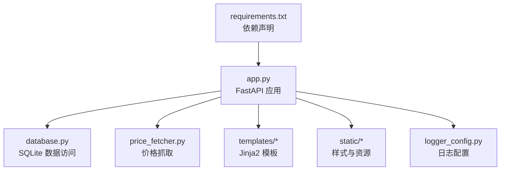
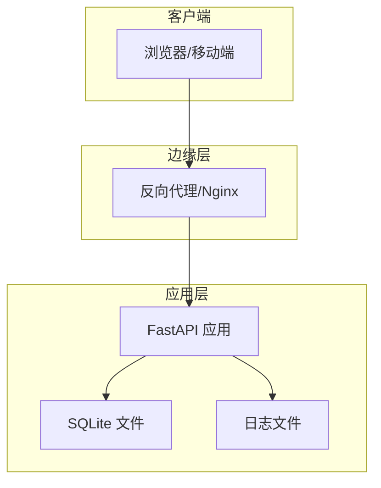
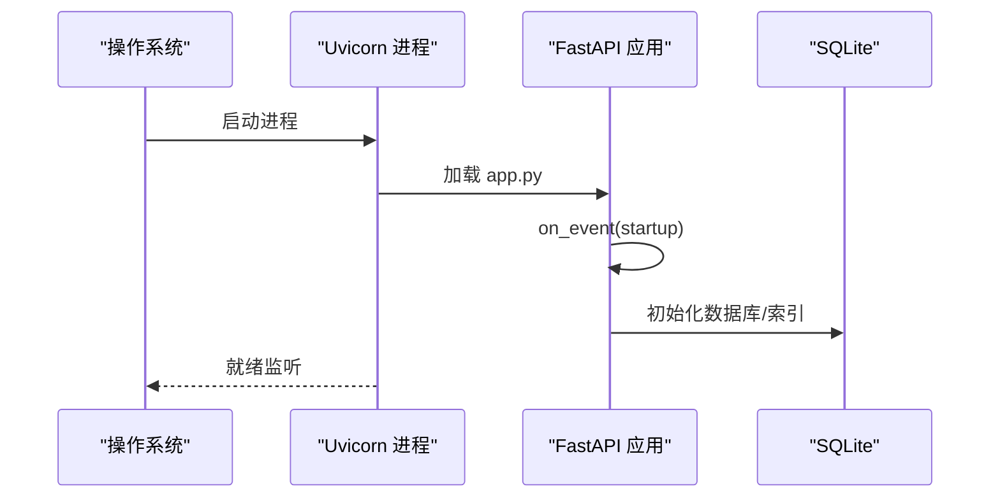
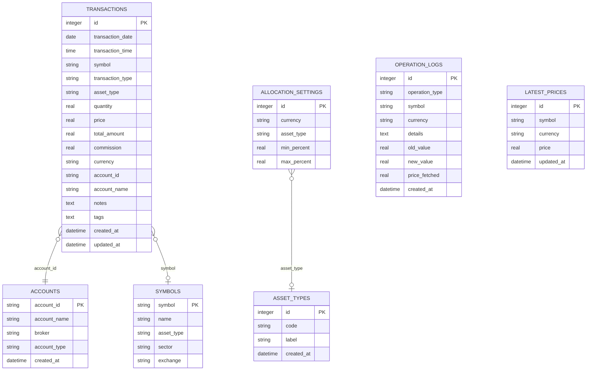
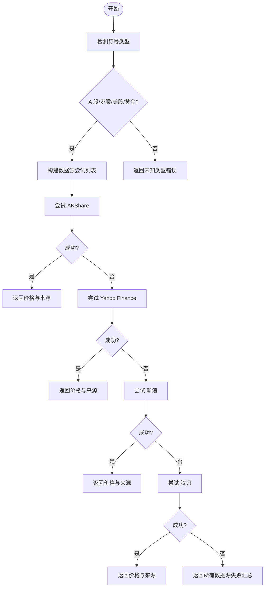
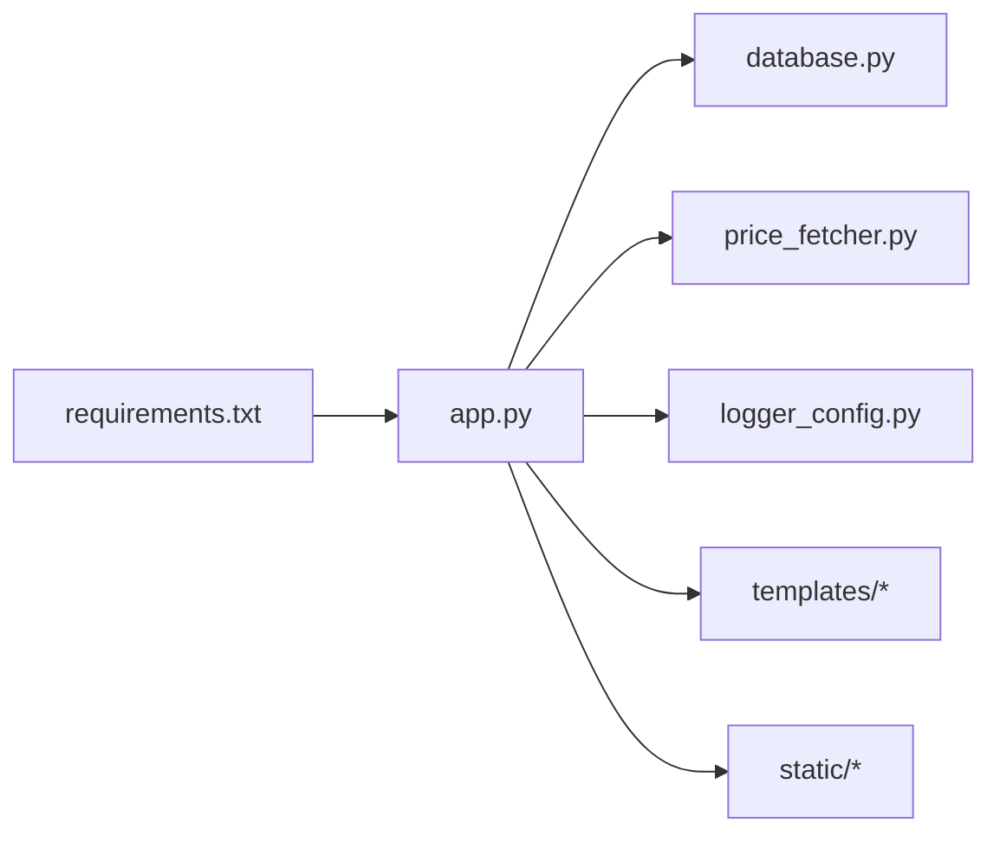

# 部署与运维

<cite>
**本文引用的文件**
- [app.py](file://app.py)
- [database.py](file://database.py)
- [logger_config.py](file://logger_config.py)
- [price_fetcher.py](file://price_fetcher.py)
- [requirements.txt](file://requirements.txt)
- [templates/base.html](file://templates/base.html)
- [templates/index.html](file://templates/index.html)
- [static/style.css](file://static/style.css)
</cite>

## 目录
1. [简介](#简介)
2. [项目结构](#项目结构)
3. [核心组件](#核心组件)
4. [架构总览](#架构总览)
5. [详细组件分析](#详细组件分析)
6. [依赖关系分析](#依赖关系分析)
7. [性能考虑](#性能考虑)
8. [监控与日志](#监控与日志)
9. [故障排除指南](#故障排除指南)
10. [备份与灾难恢复](#备份与灾难恢复)
11. [安全加固与漏洞防护](#安全加固与漏洞防护)
12. [运维自动化与CI/CD](#运维自动化与cicd)
13. [结论](#结论)

## 简介
本指南面向生产环境部署与运维，覆盖服务器配置、环境变量、进程管理、Docker 容器化与 Kubernetes 编排、性能优化（数据库、缓存、并发）、监控与日志、故障排除、备份恢复、安全加固以及运维自动化与 CI/CD 集成。项目基于 Python FastAPI + SQLite，提供交易记录与资产组合可视化能力。

## 项目结构
- 应用入口与路由：app.py
- 数据层与业务逻辑：database.py（SQLite 操作、查询聚合）
- 日志模块：logger_config.py（每日轮转日志）
- 价格抓取模块：price_fetcher.py（多数据源回退）
- 前端模板与静态资源：templates/*、static/*
- 依赖声明：requirements.txt

图表来源
- [app.py](file://app.py#L1-L444)
- [database.py](file://database.py#L1-L944)
- [price_fetcher.py](file://price_fetcher.py#L1-L398)
- [logger_config.py](file://logger_config.py#L1-L54)
- [requirements.txt](file://requirements.txt#L1-L6)

章节来源
- [app.py](file://app.py#L1-L444)
- [database.py](file://database.py#L1-L944)
- [logger_config.py](file://logger_config.py#L1-L54)
- [price_fetcher.py](file://price_fetcher.py#L1-L398)
- [requirements.txt](file://requirements.txt#L1-L6)

## 核心组件
- Web 服务与路由：FastAPI 应用，提供 HTML 页面与 REST API；启动时初始化数据库。
- 数据库层：SQLite 表结构（transactions、accounts、symbols、allocation_settings、asset_types、operation_logs、latest_prices），带索引；提供交易增删改查、持仓计算、分配比例校验、操作日志、最新价格维护等。
- 日志系统：按日轮转，保留 7 天，同时输出到控制台。
- 价格抓取：多数据源回退（AKShare、Yahoo Finance、新浪、腾讯），支持 A 股、港股、美股、黄金等。
- 前端模板：Jinja2 模板渲染页面，静态资源通过 /static 提供。

章节来源
- [app.py](file://app.py#L19-L444)
- [database.py](file://database.py#L20-L149)
- [logger_config.py](file://logger_config.py#L14-L54)
- [price_fetcher.py](file://price_fetcher.py#L321-L394)
- [templates/base.html](file://templates/base.html#L1-L27)

## 架构总览
应用采用单体架构，Web 层直接访问本地 SQLite。生产建议通过反向代理（如 Nginx）暴露服务，使用 WSGI/Uvicorn 运行器在容器内运行。

图表来源
- [app.py](file://app.py#L25-L29)
- [database.py](file://database.py#L13-L17)
- [logger_config.py](file://logger_config.py#L11-L31)

## 详细组件分析

### Web 应用与进程管理
- 启动流程：应用启动事件中初始化数据库，确保表与索引存在。
- 进程运行：开发可直接运行主程序；生产建议使用 Uvicorn 并配合 systemd 或容器编排。
- 主机与端口：默认监听 127.0.0.1:8000，生产需绑定 0.0.0.0 并由反向代理转发。

图表来源
- [app.py](file://app.py#L25-L29)
- [database.py](file://database.py#L20-L149)

章节来源
- [app.py](file://app.py#L25-L29)
- [app.py](file://app.py#L441-L444)

### 数据库与索引设计
- 表与字段：交易表、账户表、符号表、分配设置、资产类型、操作日志、最新价格。
- 索引：对 symbol、date、account_id、type、currency、asset_type 建立索引，提升查询性能。
- 查询与聚合：按货币/资产类型分组、计算持仓、成本均价、市场价值与未实现盈亏。

图表来源
- [database.py](file://database.py#L25-L147)

章节来源
- [database.py](file://database.py#L20-L149)
- [database.py](file://database.py#L312-L431)

### 价格抓取与回退机制
- 符号类型检测：根据格式与币种判断 A 股、港股、美股、黄金等。
- 回退顺序：AKShare → Yahoo Finance → 新浪 → 腾讯。
- 错误处理：记录调试日志，汇总失败原因并返回错误信息。

图表来源
- [price_fetcher.py](file://price_fetcher.py#L321-L394)

章节来源
- [price_fetcher.py](file://price_fetcher.py#L36-L62)
- [price_fetcher.py](file://price_fetcher.py#L321-L394)

### 日志与前端
- 日志：按日轮转，保留 7 天，控制台输出。
- 前端：基础模板与页面模板，静态资源通过 /static 提供，Chart.js 渲染图表。

章节来源
- [logger_config.py](file://logger_config.py#L14-L54)
- [templates/base.html](file://templates/base.html#L1-L27)
- [templates/index.html](file://templates/index.html#L1-L90)
- [static/style.css](file://static/style.css#L323-L404)

## 依赖关系分析
- app.py 依赖 database、price_fetcher、logger_config，挂载静态资源与模板目录。
- database.py 依赖 sqlite3，定义连接与表结构。
- price_fetcher.py 动态导入第三方库（AKShare、yfinance），若缺失则降级。
- requirements.txt 声明 FastAPI、Uvicorn、Jinja2、multipart、akshare。

图表来源
- [app.py](file://app.py#L7-L17)
- [requirements.txt](file://requirements.txt#L1-L6)

章节来源
- [app.py](file://app.py#L7-L23)
- [requirements.txt](file://requirements.txt#L1-L6)

## 性能考虑
- 数据库优化
  - 已建立关键列索引（symbol、date、account_id、type、currency、asset_type），避免全表扫描。
  - 分页查询：事务列表默认每页 100 条，减少单次响应数据量。
  - 聚合查询：按货币/资产类型分组统计，避免应用侧重复计算。
- 缓存配置
  - 建议引入 Redis 缓存热点数据（如最新价格、分配设置、部分聚合结果），设置合理过期时间。
  - 对高频 API（如持仓、历史）增加只读副本或本地内存缓存。
- 并发处理
  - 使用 Uvicorn 多进程/多核模式，结合反向代理负载均衡。
  - 限制并发请求与长耗时任务（如价格抓取）异步化或队列化。
- 前端优化
  - 合理拆分模板与静态资源，启用浏览器缓存与压缩。
  - 图表仅在需要时渲染，避免重复计算。

章节来源
- [database.py](file://database.py#L140-L147)
- [app.py](file://app.py#L48-L66)
- [price_fetcher.py](file://price_fetcher.py#L321-L394)

## 监控与日志
- 日志策略
  - 保留 7 天轮转日志，按天切割，便于审计与问题定位。
  - 控制台输出用于开发调试，生产建议集中采集（如 Filebeat/Fluent Bit → Elasticsearch/Logstash）。
- 指标监控
  - 应用指标：请求量、响应时间、错误率、并发数。
  - 数据库指标：连接数、慢查询、锁等待、磁盘空间。
  - 价格抓取指标：成功率、延迟、失败原因分布。
- 告警策略
  - 错误率阈值告警、数据库异常告警、价格抓取连续失败告警。

章节来源
- [logger_config.py](file://logger_config.py#L14-L54)
- [app.py](file://app.py#L223-L261)

## 故障排除指南
- 启动失败
  - 检查依赖安装与版本兼容性；确认 SQLite 文件权限。
- 页面空白或 500
  - 查看日志文件定位异常；检查数据库表是否初始化完成。
- 价格无法更新
  - 确认网络可达与第三方库可用；查看日志中的回退链路与错误摘要。
- 数据库锁或慢查询
  - 检查并发写入；为高频率查询添加索引或缓存；必要时拆分只读查询。

章节来源
- [database.py](file://database.py#L20-L149)
- [price_fetcher.py](file://price_fetcher.py#L376-L394)
- [logger_config.py](file://logger_config.py#L14-L54)

## 备份与灾难恢复
- 备份策略
  - SQLite 文件定期备份（本地+异地），建议使用增量备份工具。
  - 备份窗口内可短暂停止写入，或使用只读快照。
- 恢复流程
  - 验证备份完整性；在测试环境验证恢复；逐步切换流量。
- 灾难恢复
  - 多地容灾：跨机房复制备份；自动化切换与回滚预案。
  - RPO/RTO：根据业务需求设定目标，定期演练。

## 安全加固与漏洞防护
- 访问控制
  - 反向代理开启 TLS；限制来源 IP；启用基本认证或 OIDC。
- 输入校验
  - 对用户输入进行严格校验与转义；避免注入攻击。
- 依赖安全
  - 定期更新依赖；使用 pip-audit/safety 扫描漏洞。
- 最小权限
  - 应用以非 root 用户运行；仅授予数据库文件读写权限。
- 审计与日志
  - 记录关键操作（价格更新、资产调整、删除交易）；保留至少 7 天。

章节来源
- [app.py](file://app.py#L96-L110)
- [app.py](file://app.py#L236-L261)
- [database.py](file://database.py#L733-L772)

## 运维自动化与CI/CD
- 自动化脚本
  - 部署脚本：拉取镜像、启动容器、健康检查、滚动更新。
  - 备份脚本：定时备份 SQLite 文件并上传对象存储。
  - 监控脚本：采集指标、发送告警。
- CI/CD 流水线
  - 触发条件：push 到主分支或打标签。
  - 步骤：代码检查、单元测试、打包镜像、推送仓库、部署到预发布、自动化验收测试、发布到生产。
- 配置管理
  - 环境变量：数据库路径、日志级别、第三方 API 密钥（如有）。
  - 配置文件：模板化配置，避免硬编码。

## 结论
本指南提供了从部署到运维的完整实践路径。生产环境中应重点关注：数据库性能与索引、缓存与并发、日志与监控、安全与合规、自动化与可观测性。结合本文建议，可显著提升系统的稳定性、可维护性与安全性。