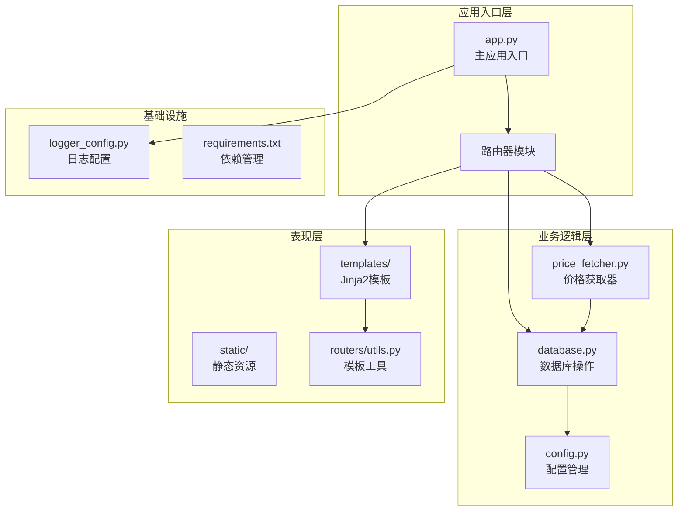
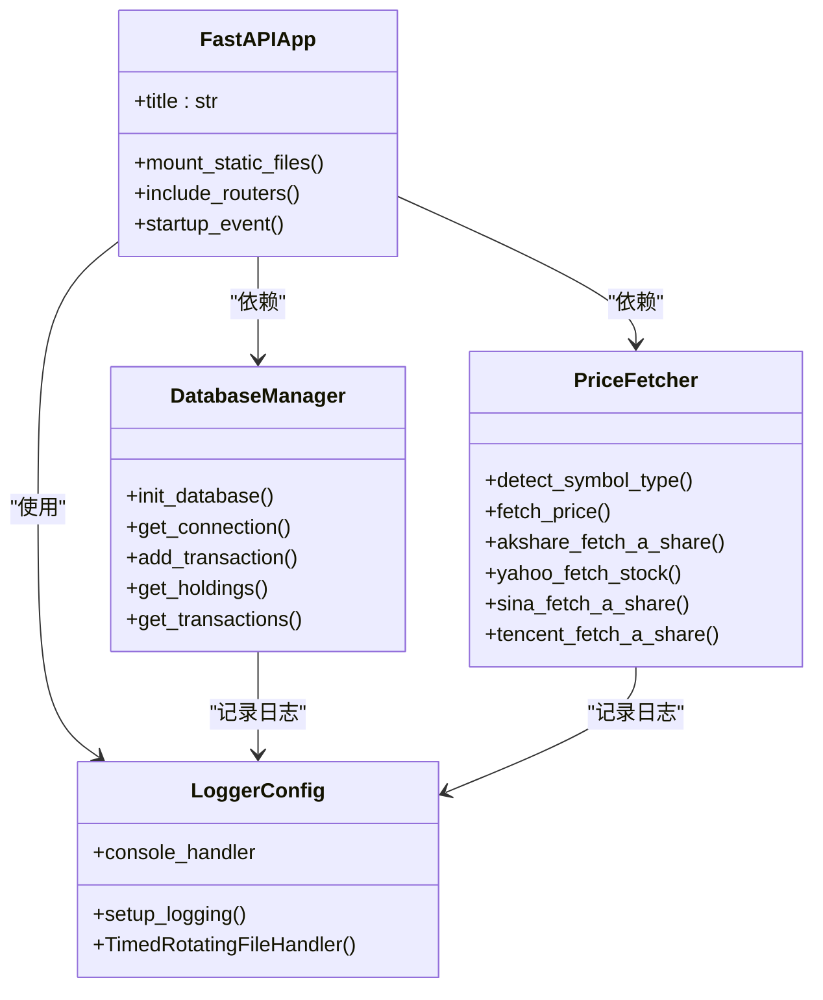
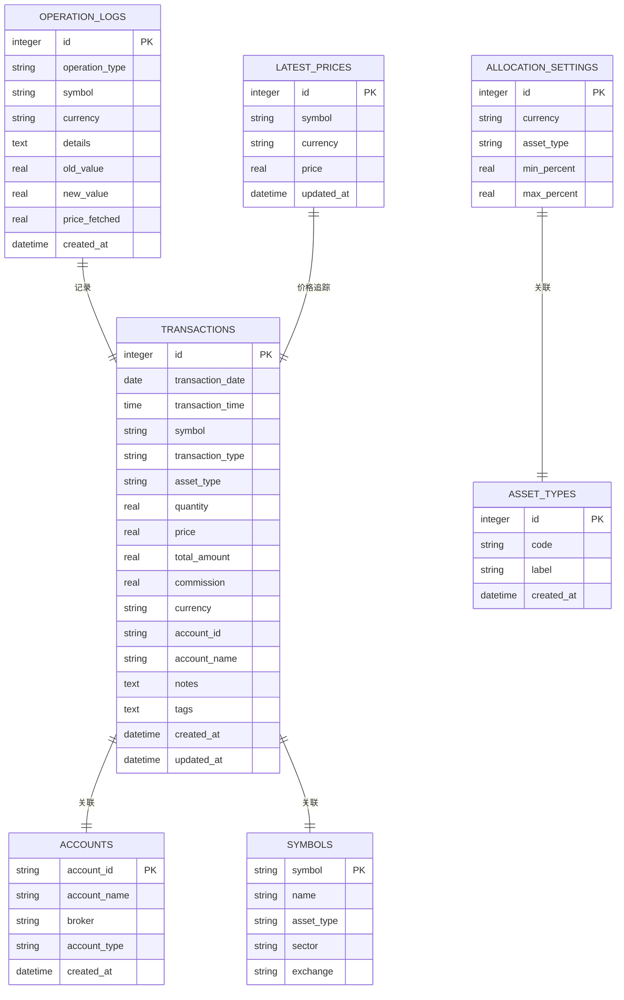
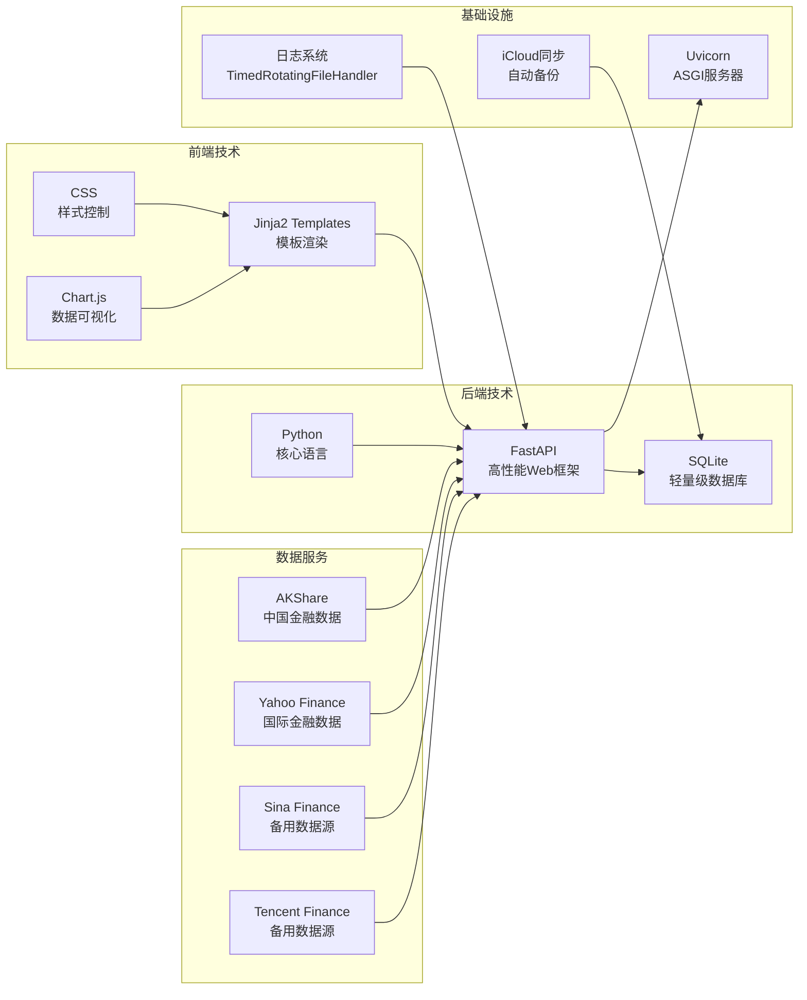
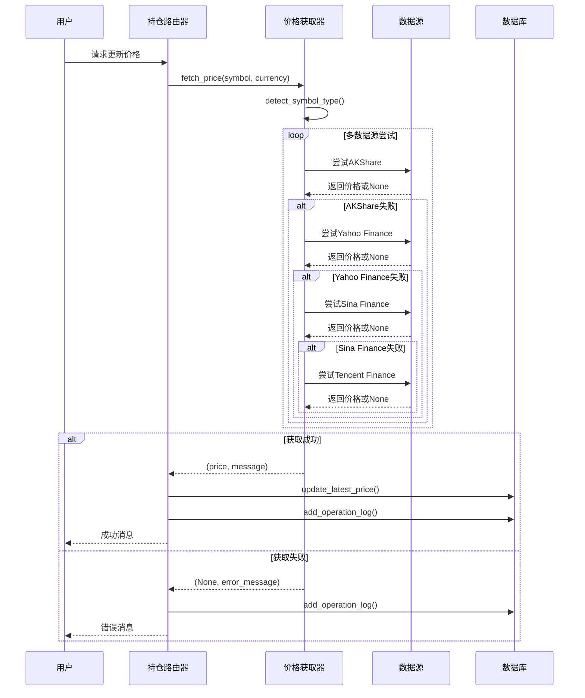
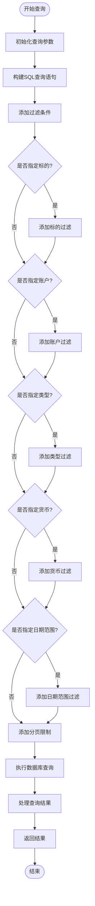
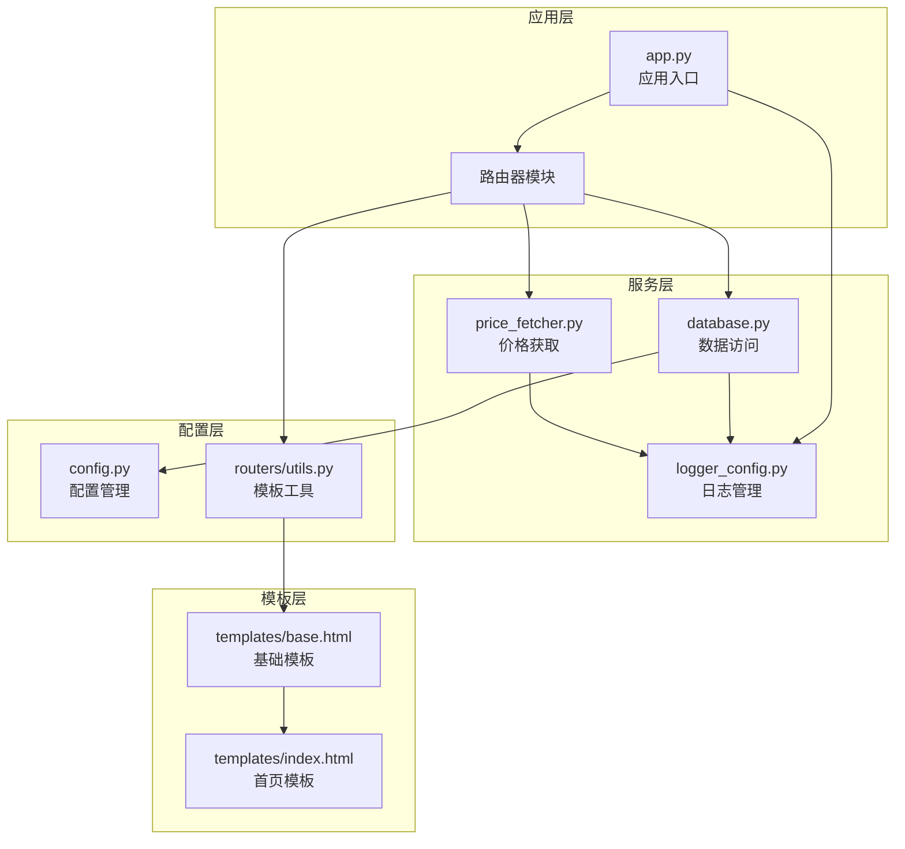
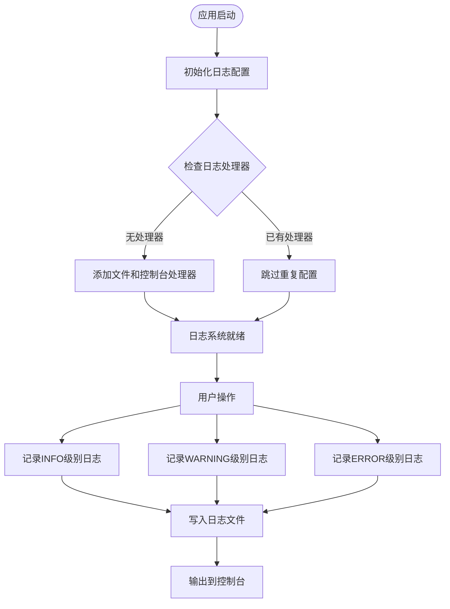

# 项目概述

<cite>
**本文档引用的文件**
- [app.py](file://app.py)
- [config.py](file://config.py)
- [database.py](file://database.py)
- [price_fetcher.py](file://price_fetcher.py)
- [requirements.txt](file://requirements.txt)
- [logger_config.py](file://logger_config.py)
- [routers/overview.py](file://routers/overview.py)
- [routers/holdings.py](file://routers/holdings.py)
- [routers/transactions.py](file://routers/transactions.py)
- [routers/settings.py](file://routers/settings.py)
- [routers/utils.py](file://routers/utils.py)
- [templates/base.html](file://templates/base.html)
- [templates/index.html](file://templates/index.html)
</cite>

## 目录
1. [引言](#引言)
2. [项目结构](#项目结构)
3. [核心组件](#核心组件)
4. [架构概览](#架构概览)
5. [详细组件分析](#详细组件分析)
6. [依赖关系分析](#依赖关系分析)
7. [性能考虑](#性能考虑)
8. [故障排除指南](#故障排除指南)
9. [结论](#结论)

## 引言

Invest Log 是一个专为个人投资者设计的投资日志管理系统，旨在帮助用户高效地跟踪和管理其投资组合。该系统采用现代化的技术栈构建，提供了直观的Web界面和强大的后端功能，支持多币种、多资产类型的综合投资管理。

### 核心目标

- **个人投资组合管理**：为个人投资者提供一站式的投资记录和分析工具
- **多市场覆盖**：支持A股、港股、美股以及黄金等多种资产类型的价格获取
- **实时价格追踪**：集成多种数据源，提供实时或准实时的市场价格更新
- **智能配置管理**：允许用户设置资产配置范围，提供投资组合平衡建议
- **跨平台同步**：通过iCloud实现数据的自动同步和备份

### 主要功能特性

- **多币种支持**：支持人民币(CNY)、美元(USD)、港币(HKD)三种货币
- **多资产类型管理**：涵盖股票(stock)、债券(bond)、贵金属(metal)、现金(cash)
- **实时价格获取**：集成AKShare、Yahoo Finance、新浪、腾讯等多个数据源
- **智能配置监控**：基于用户设定的资产配置范围进行风险预警
- **历史交易追踪**：完整记录买入、卖出、分红、拆分等各类交易行为
- **投资组合分析**：提供按货币、按资产类型、按标的的多维度分析视图

## 项目结构

Invest Log 采用清晰的分层架构设计，将业务逻辑、数据访问层和表现层有效分离：



**图表来源**
- [app.py](file://app.py#L1-L34)
- [database.py](file://database.py#L1-L150)
- [price_fetcher.py](file://price_fetcher.py#L1-L50)

### 文件组织策略

项目采用功能驱动的文件组织方式，每个核心功能模块都有独立的文件和目录：

- **routers/**：路由处理模块，按功能划分不同页面
- **templates/**：Jinja2模板文件，负责页面渲染
- **static/**：静态资源文件，包括CSS样式表
- **根目录**：核心应用逻辑和配置文件

**章节来源**
- [app.py](file://app.py#L1-L34)
- [requirements.txt](file://requirements.txt#L1-L6)

## 核心组件

### 应用核心架构

Invest Log 基于FastAPI框架构建，采用异步非阻塞I/O模型，确保高并发场景下的性能表现：



**图表来源**
- [app.py](file://app.py#L13-L29)
- [database.py](file://database.py#L15-L25)
- [price_fetcher.py](file://price_fetcher.py#L36-L66)
- [logger_config.py](file://logger_config.py#L14-L50)

### 数据库设计

系统采用SQLite作为数据存储引擎，通过精心设计的表结构支持复杂的投资组合管理需求：



**图表来源**
- [database.py](file://database.py#L28-L148)
- [database.py](file://database.py#L158-L225)

**章节来源**
- [database.py](file://database.py#L1-L150)
- [config.py](file://config.py#L17-L24)

## 架构概览

### 技术栈选择

Invest Log 选择了经过生产验证的技术栈，确保系统的稳定性、可维护性和扩展性：



**图表来源**
- [requirements.txt](file://requirements.txt#L1-L6)
- [price_fetcher.py](file://price_fetcher.py#L22-L34)
- [logger_config.py](file://logger_config.py#L24-L31)

### 系统设计理念

系统遵循以下核心设计原则：

1. **简单性优先**：保持代码简洁，避免过度工程化
2. **数据持久化**：所有投资数据都安全存储在本地数据库中
3. **离线可用**：无需网络连接即可查看历史数据
4. **增量更新**：只更新必要的数据，减少计算开销
5. **错误容错**：多数据源备份，确保价格获取的可靠性

## 详细组件分析

### 路由器模块

Invest Log 采用模块化的路由器设计，每个功能区域都有独立的路由处理器：

```mermaid
graph TB
subgraph "路由层次结构"
OVERVIEW[overview.py<br/>概览页面]
HOLDINGS[holdings.py<br/>持仓详情]
TRANSACTIONS[transactions.py<br/>交易记录]
SETTINGS[settings.py<br/>系统设置]
UTILS[routers/utils.py<br/>模板工具]
end
subgraph "页面导航"
HOME[首页 /]
HOLDINGS_PAGE[持仓页 /holdings]
SYMBOL_PAGE[标的详情 /symbol/{symbol}]
TRANSACTIONS_PAGE[交易记录 /transactions]
ADD_PAGE[添加交易 /add]
CHARTS_PAGE[图表分析 /charts]
SETTINGS_PAGE[系统设置 /settings]
end
OVERVIEW --> HOME
HOLDINGS --> HOLDINGS_PAGE
HOLDINGS --> SYMBOL_PAGE
TRANSACTIONS --> TRANSACTIONS_PAGE
TRANSACTIONS --> ADD_PAGE
SETTINGS --> SETTINGS_PAGE
OVERVIEW --> CHARTS_PAGE
```

**图表来源**
- [routers/overview.py](file://routers/overview.py#L8-L27)
- [routers/holdings.py](file://routers/holdings.py#L13-L76)
- [routers/transactions.py](file://routers/transactions.py#L10-L43)
- [routers/settings.py](file://routers/settings.py#L11-L61)

#### 价格获取流程

系统实现了智能的价格获取机制，支持多种数据源的自动切换：



**图表来源**
- [routers/holdings.py](file://routers/holdings.py#L102-L147)
- [price_fetcher.py](file://price_fetcher.py#L325-L401)

**章节来源**
- [routers/holdings.py](file://routers/holdings.py#L1-L207)
- [price_fetcher.py](file://price_fetcher.py#L1-L405)

### 数据模型与查询优化

系统通过精心设计的数据模型支持复杂的查询需求：



**图表来源**
- [database.py](file://database.py#L294-L341)
- [database.py](file://database.py#L344-L390)

**章节来源**
- [database.py](file://database.py#L294-L593)

## 依赖关系分析

### 外部依赖管理

Invest Log 的依赖关系清晰明确，每个外部库都有明确的用途：

```mermaid
graph TB
subgraph "核心运行时依赖"
FASTAPI[fastapi>=0.100.0<br/>Web框架]
UVICORN[uvicorn[standard]>=0.23.0<br/>ASGI服务器]
JINJA[jinja2>=3.1.0<br/>模板引擎]
MULTIPART[python-multipart>=0.0.6<br/>表单处理]
end
subgraph "数据获取依赖"
AKSHARE[akshare>=1.10.0<br/>中国金融数据]
YFINANCE[yfinance<br/>Yahoo Finance]
SINA[sina-finance-api<br/>备用数据源]
TENCENT[tencent-finance-api<br/>备用数据源]
end
subgraph "开发工具"
PYTEST[pytest<br/>测试框架]
BLACK[black<br/>代码格式化]
FLAKE8[flake8<br/>代码检查]
end
FASTAPI --> UVICORN
FASTAPI --> JINJA
FASTAPI --> MULTIPART
AKSHARE --> FASTAPI
YFINANCE --> FASTAPI
SINA --> FASTAPI
TENCENT --> FASTAPI
```

**图表来源**
- [requirements.txt](file://requirements.txt#L1-L6)

### 内部模块依赖

系统内部模块之间的依赖关系遵循单一职责原则：



**图表来源**
- [app.py](file://app.py#L7-L11)
- [routers/utils.py](file://routers/utils.py#L1-L4)
- [templates/base.html](file://templates/base.html#L1-L27)

**章节来源**
- [requirements.txt](file://requirements.txt#L1-L6)
- [app.py](file://app.py#L1-L34)

## 性能考虑

### 数据库性能优化

系统通过多种方式优化数据库性能：

1. **索引策略**：为常用查询字段建立索引，包括标的符号、交易日期、账户ID等
2. **连接池管理**：使用SQLite的连接工厂模式，确保连接的正确关闭
3. **批量操作**：支持批量插入和更新操作，减少数据库往返次数
4. **查询优化**：使用参数化查询，防止SQL注入攻击

### 缓存机制

系统实现了多层次的缓存策略：

- **价格缓存**：最新的市场价格存储在`latest_prices`表中
- **模板缓存**：Jinja2模板编译结果缓存
- **会话缓存**：用户会话数据缓存

### 并发处理

系统采用异步编程模型，能够有效处理高并发请求：

- **异步I/O**：使用FastAPI的异步特性
- **非阻塞操作**：数据库操作和网络请求都是非阻塞的
- **资源管理**：自动管理数据库连接和网络连接的生命周期

## 故障排除指南

### 常见问题诊断

#### 数据库连接问题

**症状**：应用启动时报数据库连接错误

**解决方案**：
1. 检查iCloud路径权限
2. 验证数据库文件完整性
3. 确认SQLite版本兼容性

#### 价格获取失败

**症状**：价格更新功能无法获取市场价格

**诊断步骤**：
1. 检查网络连接状态
2. 验证数据源可用性
3. 查看日志文件中的错误信息

#### 模板渲染错误

**症状**：页面显示空白或模板解析错误

**排查方法**：
1. 检查模板文件语法
2. 验证Jinja2版本兼容性
3. 确认模板路径配置正确

### 日志分析

系统提供了完善的日志记录机制，便于问题诊断：



**图表来源**
- [logger_config.py](file://logger_config.py#L14-L50)

**章节来源**
- [logger_config.py](file://logger_config.py#L1-L54)

## 结论

Invest Log 作为一个专业的个人投资组合管理工具，展现了现代Web应用开发的最佳实践。通过精心设计的架构、清晰的功能模块和可靠的技术选型，该系统为个人投资者提供了强大而易用的投资管理解决方案。

### 技术优势

1. **架构清晰**：采用分层架构，职责分离明确
2. **扩展性强**：模块化设计便于功能扩展
3. **性能优秀**：异步编程模型和数据库优化
4. **可靠性高**：多数据源备份和完善的错误处理
5. **用户体验好**：直观的Web界面和实时数据更新

### 发展前景

随着个人投资需求的增长和技术的不断发展，Invest Log 具备良好的扩展潜力：

- 支持更多金融数据源
- 增强数据分析和预测功能
- 提供移动端适配
- 集成更多投资工具和服务

该系统不仅是一个实用的投资管理工具，更是学习现代Web应用开发的优秀案例，展示了如何将理论知识转化为解决实际问题的软件产品。