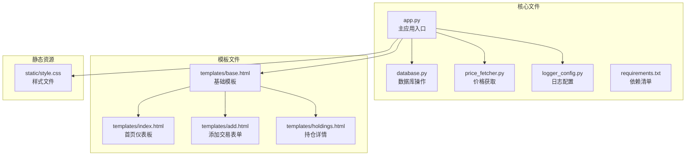

# 快速开始指南

<cite>
**本文档引用的文件**
- [app.py](file://app.py)
- [database.py](file://database.py)
- [price_fetcher.py](file://price_fetcher.py)
- [requirements.txt](file://requirements.txt)
- [logger_config.py](file://logger_config.py)
- [templates/base.html](file://templates/base.html)
- [templates/index.html](file://templates/index.html)
- [templates/add.html](file://templates/add.html)
- [templates/holdings.html](file://templates/holdings.html)
- [static/style.css](file://static/style.css)
</cite>

## 目录
1. [简介](#简介)
2. [项目结构](#项目结构)
3. [环境准备](#环境准备)
4. [安装依赖](#安装依赖)
5. [数据库初始化](#数据库初始化)
6. [启动应用](#启动应用)
7. [首次使用示例](#首次使用示例)
8. [常见配置选项](#常见配置选项)
9. [故障排除](#故障排除)
10. [总结](#总结)

## 简介

投资日志管理系统是一个基于Python的Web应用程序，用于跟踪和管理个人投资交易记录。该系统提供了直观的图形界面，支持多币种投资组合管理、实时价格获取、资产配置分析等功能。

系统采用现代Web技术栈：
- **后端框架**：FastAPI（高性能异步Web框架）
- **前端模板**：Jinja2（模板引擎）
- **数据库**：SQLite（轻量级关系型数据库）
- **价格数据**：多源API集成（支持A股、港股、美股、黄金等）

## 项目结构



**图表来源**
- [app.py](file://app.py#L1-L50)
- [database.py](file://database.py#L1-L50)
- [price_fetcher.py](file://price_fetcher.py#L1-L30)
- [logger_config.py](file://logger_config.py#L1-L30)

**章节来源**
- [app.py](file://app.py#L1-L50)
- [database.py](file://database.py#L1-L50)
- [price_fetcher.py](file://price_fetcher.py#L1-L30)

## 环境准备

### Python版本要求

系统需要Python 3.7或更高版本。请确保您的环境中已安装合适的Python版本。

验证Python版本：
```bash
python --version
```

### 系统依赖

系统使用以下核心依赖：
- **FastAPI**：高性能Web框架，提供异步请求处理
- **Uvicorn**：ASGI服务器，用于运行FastAPI应用
- **Jinja2**：模板引擎，用于渲染HTML页面
- **python-multipart**：处理multipart表单数据
- **akshare**：金融数据获取库

**章节来源**
- [requirements.txt](file://requirements.txt#L1-L6)

## 安装依赖

### 步骤1：克隆项目
```bash
git clone <repository-url>
cd invest-log
```

### 步骤2：安装依赖包
```bash
pip install -r requirements.txt
```

### 步骤3：验证安装
安装完成后，系统会自动创建以下目录结构：
```
invest-log/
├── logs/          # 日志文件目录
├── transactions.db # 数据库文件
└── 其他项目文件...
```

**章节来源**
- [requirements.txt](file://requirements.txt#L1-L6)

## 数据库初始化

### 自动初始化机制

系统在启动时会自动执行数据库初始化，无需手动干预。初始化过程包括：

1. **创建核心表结构**
   - 交易记录表（transactions）
   - 账户信息表（accounts）
   - 资产类型表（asset_types）
   - 最新价格表（latest_prices）

2. **设置索引优化**
   - 为常用查询字段建立索引
   - 提升查询性能

3. **默认数据填充**
   - 初始化标准资产类型
   - 创建默认配置项

### 手动初始化（可选）

如果需要手动初始化数据库，可以调用：
```python
import database
database.init_database()
```

**章节来源**
- [app.py](file://app.py#L25-L30)
- [database.py](file://database.py#L20-L150)

## 启动应用

### 方法一：直接运行（开发模式）

```bash
python app.py
```

### 方法二：使用Uvicorn（生产模式）

```bash
uvicorn app:app --host 127.0.0.1 --port 8000 --reload
```

### 验证启动

启动成功后，您可以在浏览器中访问：
```
http://localhost:8000
```

### 默认端口说明

- **默认端口**：8000
- **主机地址**：127.0.0.1（仅本地访问）
- **支持HTTPS**：需要额外配置

**章节来源**
- [app.py](file://app.py#L443-L446)

## 首次使用示例

### 示例1：添加第一个交易记录

1. **访问添加页面**
   ```
   http://localhost:8000/add
   ```

2. **填写交易信息**
   - 日期：选择交易日期
   - 标的代码：如 AAPL（美国股票）
   - 交易类型：买入/卖出
   - 数量：交易份额
   - 价格：每股价格
   - 账户：选择或输入账户ID

3. **提交表单**
   系统会自动计算总金额并保存记录

### 示例2：查看持仓概览

1. **访问主页**
   ```
   http://localhost:8000/
   ```

2. **查看资产分布**
   - 按币种显示投资组合分布
   - 查看各类资产占比
   - 检查是否超出配置范围

### 示例3：获取实时价格

1. **访问持仓页面**
   ```
   http://localhost:8000/holdings
   ```

2. **更新价格**
   - 点击"Update"按钮
   - 系统自动从多个数据源获取最新价格
   - 支持A股、港股、美股、黄金等

**章节来源**
- [templates/add.html](file://templates/add.html#L1-L111)
- [templates/index.html](file://templates/index.html#L1-L90)
- [templates/holdings.html](file://templates/holdings.html#L1-L177)

## 常见配置选项

### 资产配置管理

系统支持多币种资产配置监控：

| 配置项 | 可选值 | 描述 |
|--------|--------|------|
| 币种 | CNY, USD, HKD | 投资货币类型 |
| 资产类型 | stock, bond, metal, cash | 投资类别 |
| 最小比例 | 0-100% | 警告下限 |
| 最大比例 | 0-100% | 警告上限 |

### 价格数据源优先级

系统按以下顺序尝试获取价格数据：

1. **AKShare**（主要数据源）
   - 支持A股、港股、美股
   - 中国金融数据接口

2. **Yahoo Finance**（备用1）
   - 支持美股、港股
   - 国际金融数据

3. **新浪金融API**（备用2）
   - 支持A股、港股、美股
   - 中国金融数据

4. **腾讯金融API**（备用3）
   - 支持A股、港股、美股
   - 中国金融数据

### 日志配置

系统自动创建日志文件：
- **日志目录**：logs/
- **保留天数**：7天
- **轮换时间**：午夜
- **编码格式**：UTF-8

**章节来源**
- [price_fetcher.py](file://price_fetcher.py#L7-L12)
- [logger_config.py](file://logger_config.py#L1-L54)

## 故障排除

### 常见问题及解决方案

#### 问题1：端口被占用
**症状**：启动时报端口错误
**解决**：
```bash
# 更改端口号
uvicorn app:app --host 127.0.0.1 --port 8080
```

#### 问题2：价格获取失败
**症状**：无法获取实时价格
**解决**：
1. 检查网络连接
2. 安装更多数据源库：
   ```bash
   pip install akshare yfinance
   ```
3. 验证数据源可用性

#### 问题3：数据库连接错误
**症状**：无法访问数据库
**解决**：
1. 检查数据库文件权限
2. 重新初始化数据库：
   ```python
   python -c "import database; database.init_database()"
   ```

#### 问题4：模板加载错误
**症状**：页面显示为空白
**解决**：
1. 确认templates目录存在
2. 检查Jinja2安装：
   ```bash
   pip install jinja2
   ```

### 性能优化建议

1. **数据库优化**
   - 定期备份数据库
   - 清理历史数据（可选）

2. **内存管理**
   - 合理设置分页数量
   - 避免一次性加载大量数据

3. **网络优化**
   - 配置代理（如需）
   - 缓存常用数据

**章节来源**
- [app.py](file://app.py#L25-L30)
- [price_fetcher.py](file://price_fetcher.py#L23-L34)

## 总结

投资日志管理系统提供了完整的投资追踪解决方案，具有以下特点：

### 核心优势
- **易于部署**：单文件应用，零配置启动
- **功能完整**：支持多币种、多资产类型管理
- **实时数据**：集成多个数据源获取最新价格
- **可视化展示**：直观的投资组合分布图表

### 使用建议
1. **首次使用**：先添加少量交易记录测试系统
2. **定期维护**：每周更新一次资产价格
3. **数据备份**：定期备份数据库文件
4. **扩展功能**：根据需要添加新的数据源

### 技术特性
- **响应式设计**：支持桌面和移动设备
- **实时更新**：价格数据自动刷新
- **安全可靠**：SQLite本地存储，数据持久化
- **开源免费**：完全开源，无使用限制

通过本指南，您应该能够在5分钟内成功运行系统并进行基本操作。如需更高级的功能，请参考系统的完整文档和API说明。