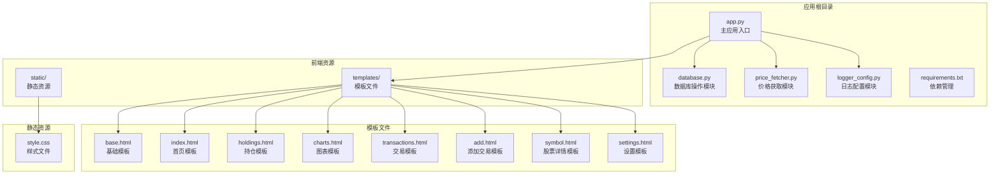
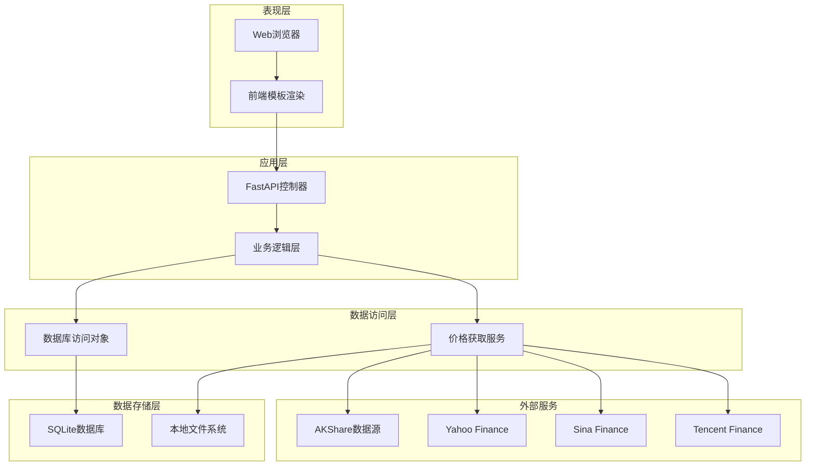
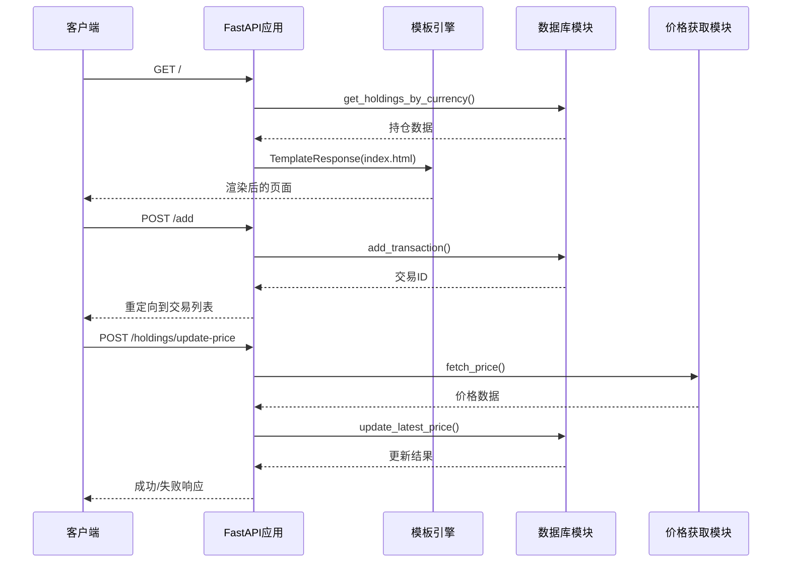
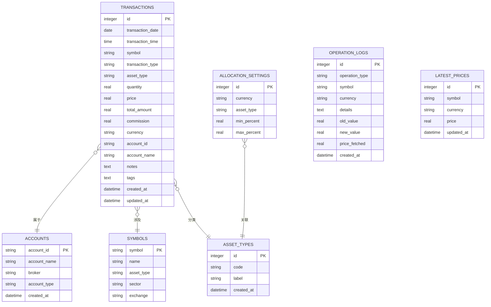
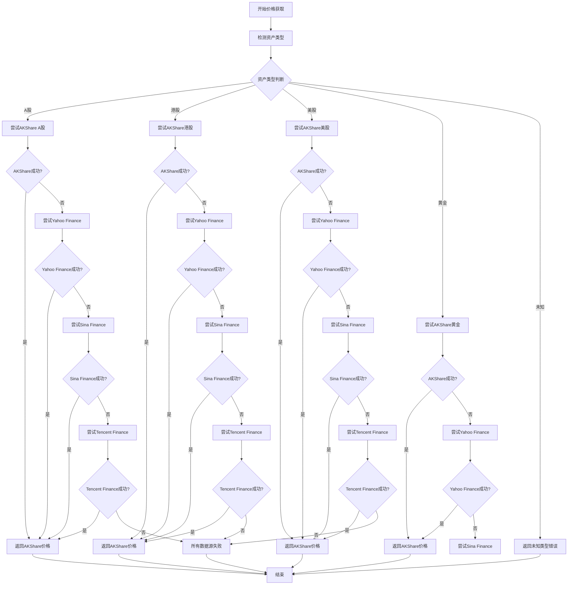
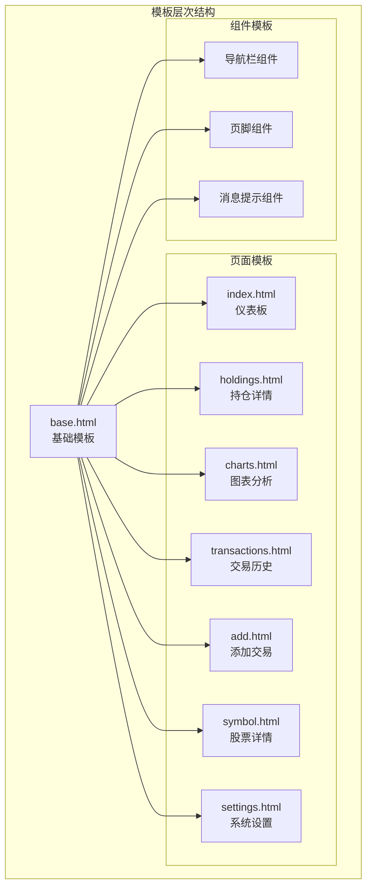
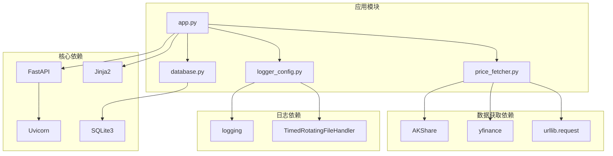

# 技术架构概览

<cite>
**本文档引用的文件**
- [app.py](file://app.py)
- [database.py](file://database.py)
- [price_fetcher.py](file://price_fetcher.py)
- [requirements.txt](file://requirements.txt)
- [logger_config.py](file://logger_config.py)
- [templates/base.html](file://templates/base.html)
- [templates/index.html](file://templates/index.html)
- [static/style.css](file://static/style.css)
</cite>

## 目录
1. [简介](#简介)
2. [项目结构](#项目结构)
3. [核心组件](#核心组件)
4. [架构概览](#架构概览)
5. [详细组件分析](#详细组件分析)
6. [依赖关系分析](#依赖关系分析)
7. [性能考虑](#性能考虑)
8. [故障排除指南](#故障排除指南)
9. [结论](#结论)

## 简介

投资日志管理系统是一个基于现代Python技术栈构建的个人投资追踪应用。该系统采用前后端分离的设计模式，后端使用FastAPI框架提供高性能的Web服务，前端使用Jinja2模板引擎进行动态页面渲染，数据库采用SQLite实现轻量级本地存储，价格数据获取通过AKShare库实现多数据源支持，图表展示使用Chart.js实现可视化。

## 项目结构

该项目采用模块化设计，主要包含以下核心目录和文件：

**图表来源**
- [app.py](file://app.py#L1-L50)
- [database.py](file://database.py#L1-L50)
- [price_fetcher.py](file://price_fetcher.py#L1-L50)
- [logger_config.py](file://logger_config.py#L1-L50)

**章节来源**
- [app.py](file://app.py#L1-L50)
- [requirements.txt](file://requirements.txt#L1-L6)

## 核心组件

### 后端框架 - FastAPI

FastAPI作为本项目的后端核心框架，提供了现代化的异步Web开发体验。其主要特点包括：

- **高性能异步处理**：基于Starlette和Pydantic，支持异步I/O操作
- **自动API文档**：内置Swagger UI和ReDoc文档生成
- **类型安全**：通过Python类型注解实现运行时数据验证
- **依赖注入**：内置依赖管理系统，支持复杂的依赖关系

### 数据库层 - SQLite

采用SQLite作为本地数据库，具有以下优势：

- **零配置部署**：无需独立数据库服务器
- **轻量级存储**：适合个人用户的小规模数据需求
- **ACID事务**：保证数据一致性和完整性
- **跨平台兼容**：支持多种操作系统

### 前端模板 - Jinja2

Jinja2模板引擎提供了强大的模板渲染能力：

- **动态内容生成**：支持条件判断、循环遍历等控制结构
- **模板继承**：通过base.html实现模板复用
- **过滤器支持**：内置丰富的数据格式化功能
- **安全性**：自动转义输出，防止XSS攻击

### 价格数据获取 - AKShare

集成AKShare库实现多市场数据获取：

- **多数据源支持**：支持A股、港股、美股、黄金等多种资产类型
- **自动降级机制**：当主数据源不可用时自动切换备用源
- **统一接口抽象**：对外提供统一的价格查询接口

**章节来源**
- [app.py](file://app.py#L19-L30)
- [database.py](file://database.py#L20-L150)
- [price_fetcher.py](file://price_fetcher.py#L1-L50)
- [templates/base.html](file://templates/base.html#L1-L27)

## 架构概览

系统采用分层架构设计，清晰分离关注点：

**图表来源**
- [app.py](file://app.py#L36-L122)
- [database.py](file://database.py#L13-L18)
- [price_fetcher.py](file://price_fetcher.py#L321-L395)

### MVC架构模式应用

系统实现了经典的MVC（Model-View-Controller）架构模式：

**Model层**：由database.py中的数据库操作函数构成，负责数据持久化和业务规则实现。

**View层**：由templates目录下的Jinja2模板文件组成，负责用户界面渲染。

**Controller层**：由app.py中的FastAPI路由处理器承担，负责请求处理和响应生成。

### 设计模式应用

#### 工厂模式
在价格获取模块中实现了工厂模式：
- `detect_symbol_type()`函数根据符号特征自动识别资产类型
- 不同的资产类型对应不同的数据获取策略

#### 单例模式
日志配置采用了单例模式：
- `setup_logging()`函数确保日志记录器只初始化一次
- 避免重复的日志处理器注册

#### 策略模式
价格获取服务实现了策略模式：
- 多个数据源获取函数形成可替换的策略集合
- 根据可用性自动选择最优策略

**章节来源**
- [app.py](file://app.py#L36-L122)
- [database.py](file://database.py#L673-L727)
- [price_fetcher.py](file://price_fetcher.py#L36-L63)

## 详细组件分析

### 应用入口与路由管理

主应用文件app.py定义了完整的路由体系：

**图表来源**
- [app.py](file://app.py#L36-L122)
- [app.py](file://app.py#L216-L262)

#### API端点设计

系统提供了RESTful API端点用于前后端分离：

- `/api/holdings` - 获取当前持仓信息
- `/api/holdings-by-currency` - 按货币分组的持仓统计
- `/api/transactions` - 交易历史查询
- `/api/portfolio-history` - 组合历史价值计算
- `/api/transactions/{id}` - 删除特定交易

**章节来源**
- [app.py](file://app.py#L378-L441)

### 数据库架构设计

数据库采用关系型设计，支持多表关联和复杂查询：

**图表来源**
- [database.py](file://database.py#L25-L147)

#### 数据模型特点

- **完整性约束**：通过CHECK约束确保数据有效性
- **索引优化**：为常用查询字段建立索引提升性能
- **扩展性设计**：支持动态资产类型管理和配置设置
- **审计跟踪**：完整的操作日志记录机制

**章节来源**
- [database.py](file://database.py#L20-L150)
- [database.py](file://database.py#L605-L727)

### 价格获取服务架构

价格获取模块实现了多数据源的容错机制：

**图表来源**
- [price_fetcher.py](file://price_fetcher.py#L321-L395)

#### 数据源优先级策略

系统按照以下优先级顺序获取价格数据：

1. **AKShare** - 主要数据源，支持中国A股市场
2. **Yahoo Finance** - 备用数据源，支持全球主要市场
3. **Sina Finance API** - 备用数据源，提供实时行情
4. **Tencent Finance API** - 最终备用数据源

**章节来源**
- [price_fetcher.py](file://price_fetcher.py#L7-L12)
- [price_fetcher.py](file://price_fetcher.py#L321-L395)

### 前端模板系统

模板系统采用Jinja2，实现了高度模块化的前端架构：

**图表来源**
- [templates/base.html](file://templates/base.html#L1-L27)
- [templates/index.html](file://templates/index.html#L1-L90)

#### 模板继承机制

通过模板继承实现了代码复用：
- 所有页面模板继承自base.html
- 共享导航栏、样式文件和JavaScript库
- 支持块(block)级别的内容覆盖

**章节来源**
- [templates/base.html](file://templates/base.html#L1-L27)
- [templates/index.html](file://templates/index.html#L1-L90)

## 依赖关系分析

系统依赖关系清晰明确，各模块职责分离：

**图表来源**
- [requirements.txt](file://requirements.txt#L1-L6)
- [app.py](file://app.py#L7-L17)
- [price_fetcher.py](file://price_fetcher.py#L22-L34)

### 外部库选择理由

#### FastAPI
- **性能优势**：基于ASGI异步协议，支持高并发处理
- **开发效率**：自动生成API文档，减少重复工作
- **类型安全**：编译时类型检查，降低运行时错误

#### AKShare
- **专业性**：专门针对中国金融市场设计的数据接口
- **稳定性**：经过大量用户验证，API相对稳定
- **覆盖面广**：支持多个金融市场的实时数据

#### Chart.js
- **易用性**：简洁的API设计，学习成本低
- **可视化丰富**：支持多种图表类型和交互效果
- **社区活跃**：文档完善，问题解决及时

**章节来源**
- [requirements.txt](file://requirements.txt#L1-L6)
- [price_fetcher.py](file://price_fetcher.py#L7-L12)

## 性能考虑

### 数据库性能优化

系统在数据库层面实施了多项性能优化措施：

- **索引策略**：为常用查询字段建立索引，包括symbol、transaction_date、account_id等
- **查询优化**：使用参数化查询防止SQL注入，避免全表扫描
- **连接池管理**：通过row_factory提高数据访问效率

### 缓存机制

实现了多层次的缓存策略：

- **价格缓存**：latest_prices表存储最近获取的价格数据
- **模板缓存**：Jinja2模板编译后的字节码缓存
- **会话缓存**：FastAPI中间件提供的请求响应缓存

### 异步处理

利用FastAPI的异步特性提升并发处理能力：

- **非阻塞I/O**：数据库查询和网络请求采用异步方式
- **并发限制**：通过Uvicorn的worker配置控制并发度
- **超时管理**：合理设置请求超时时间，避免资源占用

## 故障排除指南

### 常见问题诊断

#### 数据库连接问题
- **症状**：应用启动时报数据库连接错误
- **解决方案**：检查数据库文件权限，确认SQLite3库正确安装

#### 价格获取失败
- **症状**：持仓页面显示价格获取失败
- **解决方案**：检查网络连接，验证AKShare库版本，查看日志文件

#### 模板渲染错误
- **症状**：页面显示模板语法错误
- **解决方案**：检查模板文件语法，确认变量传递正确

### 日志分析

系统提供了完善的日志记录机制：

- **应用日志**：记录请求处理过程和错误信息
- **操作日志**：记录用户的重要操作行为
- **价格获取日志**：详细记录价格数据获取过程

**章节来源**
- [logger_config.py](file://logger_config.py#L14-L54)
- [app.py](file://app.py#L223-L261)

## 结论

投资日志管理系统采用现代化的技术栈构建，实现了高性能、可维护、易扩展的投资追踪解决方案。系统的主要优势包括：

1. **技术选型合理**：FastAPI提供高性能Web服务，SQLite适合个人使用场景
2. **架构设计清晰**：分层架构和MVC模式确保代码组织良好
3. **功能完整**：涵盖投资管理的核心功能，包括交易记录、持仓分析、价格获取等
4. **用户体验优秀**：直观的界面设计和实时数据展示
5. **可扩展性强**：模块化设计便于功能扩展和维护

该系统特别适合个人投资者进行日常投资管理，既满足了功能需求，又保持了良好的性能表现和用户体验。