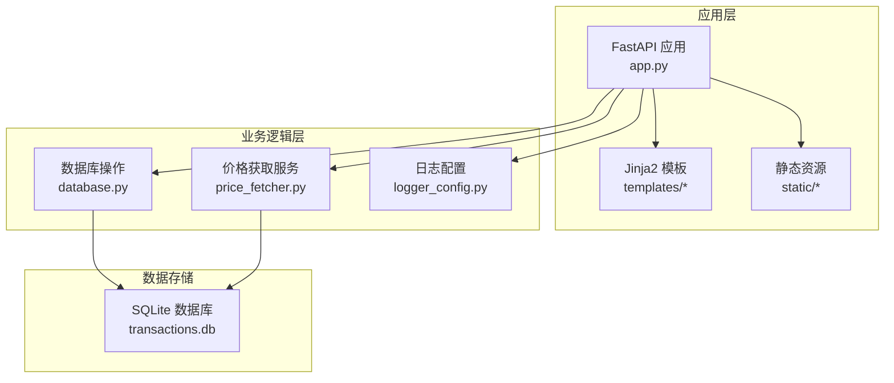
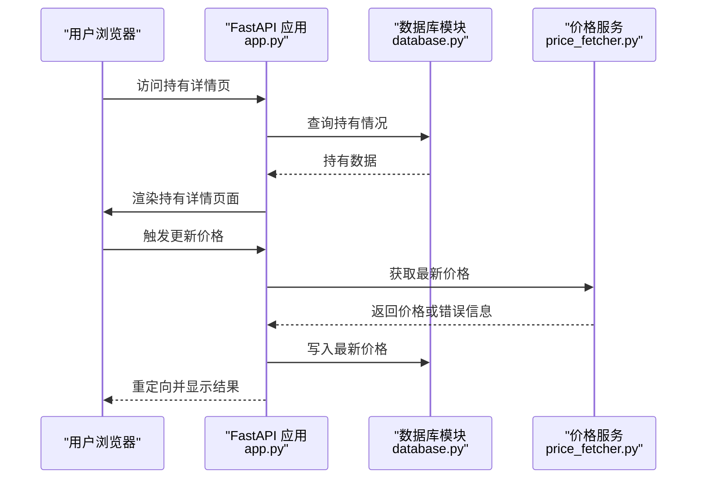
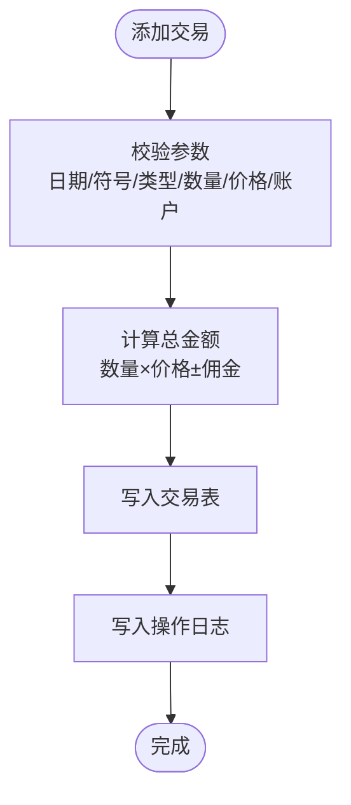
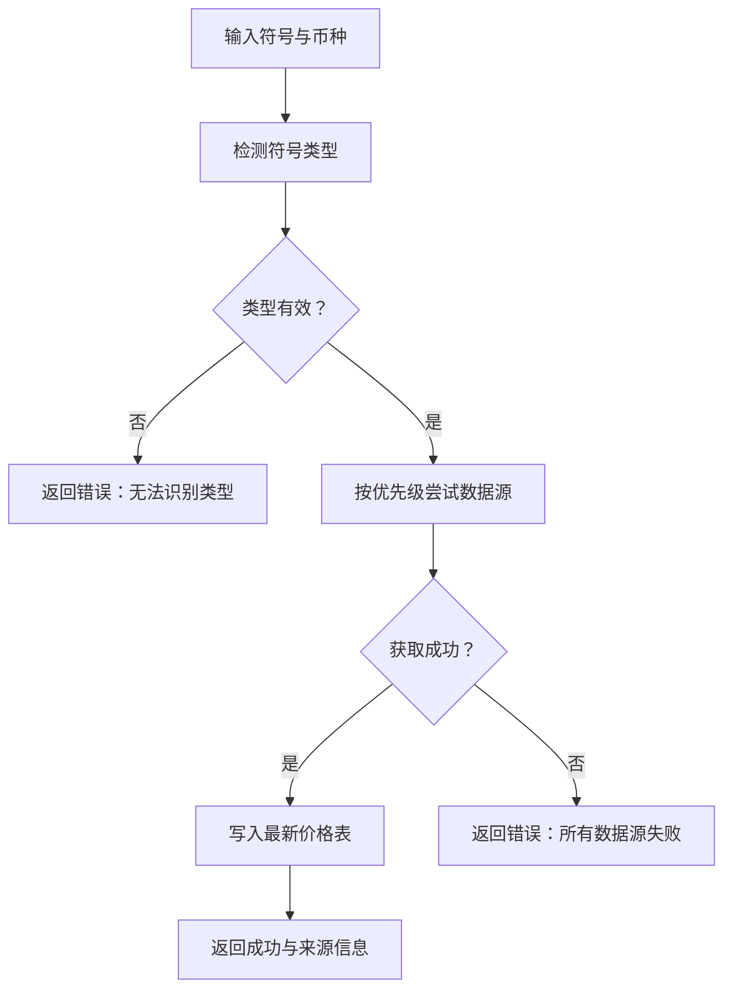
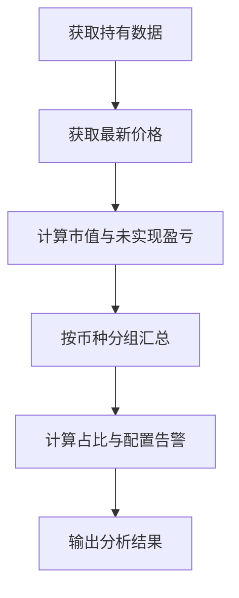
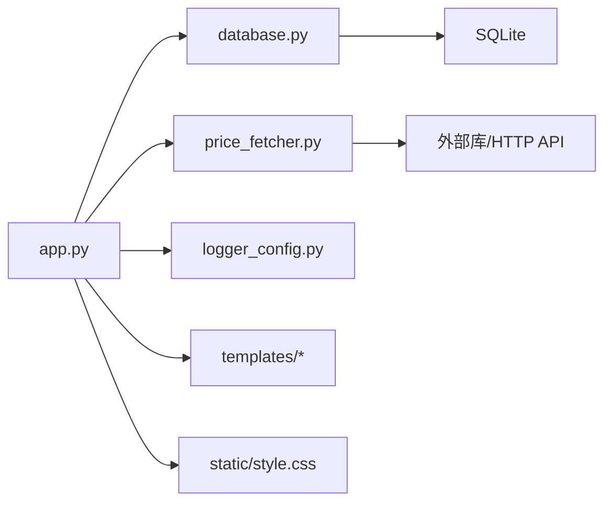

# 核心功能特性

<cite>
**本文档引用的文件**
- [app.py](file://app.py)
- [database.py](file://database.py)
- [price_fetcher.py](file://price_fetcher.py)
- [logger_config.py](file://logger_config.py)
- [requirements.txt](file://requirements.txt)
- [templates/base.html](file://templates/base.html)
- [templates/index.html](file://templates/index.html)
- [templates/holdings.html](file://templates/holdings.html)
- [templates/settings.html](file://templates/settings.html)
- [templates/add.html](file://templates/add.html)
- [templates/transactions.html](file://templates/transactions.html)
- [templates/symbol.html](file://templates/symbol.html)
- [static/style.css](file://static/style.css)
</cite>

## 目录
1. [简介](#简介)
2. [项目结构](#项目结构)
3. [核心组件](#核心组件)
4. [架构总览](#架构总览)
5. [详细组件分析](#详细组件分析)
6. [依赖关系分析](#依赖关系分析)
7. [性能考虑](#性能考虑)
8. [故障排除指南](#故障排除指南)
9. [结论](#结论)

## 简介
本项目是一个基于 Python 的投资日志管理系统，采用 FastAPI 提供 Web 接口与 Jinja2 模板渲染，SQLite 数据库存储交易与资产信息，支持多币种（CNY、USD、HKD）与多资产类型（股票、债券、贵金属、现金），并提供交易记录管理、实时价格追踪、投资组合分析、设置与配置等功能。系统通过多数据源价格获取与回退机制确保价格数据的可用性，并提供直观的可视化界面帮助用户进行投资决策与风险评估。

## 项目结构
项目采用分层组织方式：
- 应用入口与路由：app.py
- 数据访问层：database.py（SQLite 操作、查询聚合）
- 价格服务：price_fetcher.py（多数据源价格获取与回退）
- 日志配置：logger_config.py
- 前端模板与静态资源：templates/* 与 static/*
- 依赖声明：requirements.txt

图表来源
- [app.py](file://app.py#L1-L446)
- [database.py](file://database.py#L1-L944)
- [price_fetcher.py](file://price_fetcher.py#L1-L398)
- [logger_config.py](file://logger_config.py#L1-L54)

章节来源
- [app.py](file://app.py#L1-L446)
- [database.py](file://database.py#L1-L944)
- [price_fetcher.py](file://price_fetcher.py#L1-L398)
- [logger_config.py](file://logger_config.py#L1-L54)

## 核心组件
- 交易记录管理：支持买入、卖出、分红、拆股、转账、调整等交易类型，提供增删改查与批量查询接口。
- 实时价格追踪：多数据源价格获取与回退机制，支持 A 股、港股、美股、黄金等标的。
- 投资组合分析：按币种与资产类型分组汇总，计算持仓分布、成本与市值、未实现盈亏与百分比。
- 多币种支持：统一在交易记录中记录币种，前端按币种显示货币符号。
- 多资产类型管理：动态资产类型定义与使用，独立于币种，可扩展新类型。
- 设置与配置：资产配置比例管理（最小/最大百分比）、资产类型增删、操作日志记录。

章节来源
- [app.py](file://app.py#L36-L188)
- [database.py](file://database.py#L20-L149)
- [price_fetcher.py](file://price_fetcher.py#L321-L394)
- [templates/index.html](file://templates/index.html#L1-L90)
- [templates/holdings.html](file://templates/holdings.html#L1-L177)
- [templates/settings.html](file://templates/settings.html#L1-L104)

## 架构总览
系统采用“Web 层 + 业务层 + 数据层”的三层架构：
- Web 层：FastAPI 路由与页面渲染，处理用户请求与表单提交。
- 业务层：数据库模块负责交易、账户、价格、设置等核心业务逻辑；价格模块负责多数据源价格获取。
- 数据层：SQLite 存储交易、账户、资产类型、价格、设置、操作日志等。

图表来源
- [app.py](file://app.py#L144-L188)
- [app.py](file://app.py#L216-L262)
- [database.py](file://database.py#L779-L800)
- [price_fetcher.py](file://price_fetcher.py#L321-L394)

## 详细组件分析

### 交易记录管理
- 功能概述
  - 支持多种交易类型：买入、卖出、分红、拆股、转账（转入/转出）、调整。
  - 统一记录币种、资产类型、账户、佣金、备注等字段。
  - 提供交易列表分页展示与删除接口。
- 实现要点
  - 数据模型包含交易主表、账户表、资产类型表、最新价格表、操作日志表。
  - 交易查询支持按符号、账户、类型、币种、年份、日期范围过滤。
  - 持仓计算综合考虑买入/卖出/转账/拆股/调整等交易类型，按符号、账户、币种、资产类型分组统计。
- 用户价值
  - 全面记录投资活动，便于收益分析、税务与报表准备。
  - 快速定位历史交易，支持批量导出与审计。

图表来源
- [app.py](file://app.py#L83-L111)
- [database.py](file://database.py#L156-L194)
- [database.py](file://database.py#L733-L756)

章节来源
- [app.py](file://app.py#L48-L111)
- [database.py](file://database.py#L262-L310)
- [database.py](file://database.py#L312-L358)
- [templates/add.html](file://templates/add.html#L1-L111)
- [templates/transactions.html](file://templates/transactions.html#L1-L91)

### 实时价格追踪
- 功能概述
  - 自动从多个数据源获取最新价格，支持 A 股、港股、美股、黄金等标的。
  - 失败时按优先级回退至其他数据源，最终返回错误信息。
- 实现要点
  - 符号类型检测：根据符号格式与币种判断 A 股、港股、美股、黄金等。
  - 多数据源顺序：AKShare（主）、Yahoo Finance、Sina Finance、Tencent Finance。
  - 最新价格存储：latest_prices 表，按符号+币种唯一键维护最新价格与更新时间。
- 用户价值
  - 一键刷新价格，提升投资组合估值准确性。
  - 在网络波动或单一数据源异常时仍能获取价格。

图表来源
- [price_fetcher.py](file://price_fetcher.py#L36-L63)
- [price_fetcher.py](file://price_fetcher.py#L321-L394)
- [database.py](file://database.py#L779-L800)

章节来源
- [price_fetcher.py](file://price_fetcher.py#L1-L398)
- [database.py](file://database.py#L128-L138)
- [app.py](file://app.py#L216-L262)

### 投资组合分析
- 功能概述
  - 按币种汇总持有情况，计算各资产类型的金额与占比。
  - 结合配置比例设置，对超配/低配进行告警提示。
  - 显示未实现盈亏与百分比，支持按符号查看明细。
- 实现要点
  - 持仓汇总：按币种、资产类型分组，计算总份额、总成本、平均成本。
  - 市值与盈亏：结合最新价格计算市值与未实现盈亏，按市值计算占比。
  - 配置检查：读取 allocation_settings，对比当前占比生成警告。
- 用户价值
  - 可视化资产配置，及时发现偏离目标的风险。
  - 辅助再平衡与投资策略制定。

图表来源
- [database.py](file://database.py#L361-L432)
- [database.py](file://database.py#L673-L726)
- [templates/index.html](file://templates/index.html#L1-L90)
- [templates/holdings.html](file://templates/holdings.html#L1-L177)

章节来源
- [database.py](file://database.py#L361-L432)
- [database.py](file://database.py#L673-L726)
- [templates/index.html](file://templates/index.html#L1-L90)
- [templates/holdings.html](file://templates/holdings.html#L1-L177)

### 多币种支持
- 功能概述
  - 交易记录统一记录币种（CNY、USD、HKD），前端按币种显示对应货币符号。
  - 报表与图表按币种维度进行分组与汇总。
- 实现要点
  - 数据库约束限制币种枚举，确保一致性。
  - 前端模板根据币种选择相应货币符号。
- 用户价值
  - 支持跨境投资与多币种计价，避免汇率混淆。
  - 报表清晰直观，便于跨币种比较与分析。

章节来源
- [database.py](file://database.py#L38-L38)
- [templates/index.html](file://templates/index.html#L14-L16)
- [templates/holdings.html](file://templates/holdings.html#L21-L28)

### 多资产类型管理
- 功能概述
  - 支持股票、债券、贵金属、现金等资产类型，可动态新增与删除。
  - 资产类型独立于币种，可在任意币种下使用。
- 实现要点
  - 资产类型表提供代码与标签映射，前端以标签展示。
  - 删除前检查是否被使用，避免破坏数据完整性。
- 用户价值
  - 扩展性强，适应不同投资组合构成。
  - 保持数据一致与可维护性。

章节来源
- [database.py](file://database.py#L88-L112)
- [database.py](file://database.py#L33-L33)
- [templates/settings.html](file://templates/settings.html#L1-L104)
- [app.py](file://app.py#L354-L372)

### 设置与配置功能
- 功能概述
  - 资产配置比例管理：为每种币种与资产类型设置最小/最大百分比，系统在持有页面给出告警。
  - 资产类型管理：新增/删除资产类型，删除时进行依赖检查。
  - 操作日志：记录价格更新、资产调整等关键操作。
- 实现要点
  - 配置持久化：allocation_settings 表保存设置，支持按币种+资产类型唯一约束。
  - 表单提交：后端解析表单，批量更新配置。
- 用户价值
  - 主动风险管理，避免过度集中于某一资产类别。
  - 系统可定制化，满足个人或机构的投资偏好。

章节来源
- [app.py](file://app.py#L294-L372)
- [database.py](file://database.py#L615-L671)
- [database.py](file://database.py#L733-L773)
- [templates/settings.html](file://templates/settings.html#L1-L104)

## 依赖关系分析
- 应用层依赖
  - app.py 依赖 database.py 进行数据访问，依赖 price_fetcher.py 进行价格获取，依赖 logger_config.py 进行日志记录。
- 数据层依赖
  - database.py 依赖 sqlite3 连接数据库，创建并维护多张表。
- 价格服务依赖
  - price_fetcher.py 依赖外部库（如 akshare、yfinance），并在缺失时降级使用 HTTP API。
- 前端依赖
  - 模板依赖 Chart.js 进行图表渲染，依赖静态样式文件美化界面。

图表来源
- [app.py](file://app.py#L1-L18)
- [database.py](file://database.py#L1-L18)
- [price_fetcher.py](file://price_fetcher.py#L22-L34)
- [logger_config.py](file://logger_config.py#L1-L54)

章节来源
- [app.py](file://app.py#L1-L18)
- [database.py](file://database.py#L1-L18)
- [price_fetcher.py](file://price_fetcher.py#L22-L34)
- [logger_config.py](file://logger_config.py#L1-L54)

## 性能考虑
- 数据库索引
  - 对 symbol、transaction_date、account_id、transaction_type、currency、asset_type 等常用查询字段建立索引，提升查询效率。
- 分页与限制
  - 交易列表默认每页 100 条，避免一次性加载过多数据。
- 计算优化
  - 持仓与分析在数据库侧聚合，减少 Python 层重复计算。
- 网络请求
  - 价格获取采用多数据源回退，避免单点故障；对 HTTP 请求设置合理超时。
- 前端渲染
  - 使用 Chart.js 渲染图表，按需初始化，避免不必要的重绘。

章节来源
- [database.py](file://database.py#L140-L147)
- [app.py](file://app.py#L49-L66)
- [price_fetcher.py](file://price_fetcher.py#L376-L394)
- [static/style.css](file://static/style.css#L1-L800)

## 故障排除指南
- 价格获取失败
  - 现象：更新价格后提示失败。
  - 排查：检查外部库是否安装（akshare、yfinance），确认网络连通性；查看日志文件定位具体错误。
  - 处理：确保安装 requirements.txt 中的依赖，或等待备用数据源可用。
- 交易记录异常
  - 现象：交易列表为空或显示不正确。
  - 排查：确认数据库连接正常，检查交易类型与币种枚举是否符合约束。
  - 处理：重新初始化数据库或修复数据。
- 配置比例无效
  - 现象：设置保存后未生效。
  - 排查：确认最小/最大值范围合法且小于等于 100%，币种与资产类型存在。
  - 处理：修正数值范围或添加资产类型。
- 删除资产类型失败
  - 现象：提示“已被使用”无法删除。
  - 排查：确认该资产类型是否仍有交易记录使用。
  - 处理：先清理相关交易，再执行删除。

章节来源
- [requirements.txt](file://requirements.txt#L1-L6)
- [logger_config.py](file://logger_config.py#L1-L54)
- [database.py](file://database.py#L638-L642)
- [app.py](file://app.py#L365-L372)

## 结论
本系统通过清晰的分层架构与完善的业务模块，实现了从交易记录到价格追踪再到投资组合分析的全链路管理。多数据源价格获取与回退机制提升了系统的鲁棒性，多币种与多资产类型的支持增强了适用性，而设置与配置功能则为用户提供了主动风险管理工具。建议后续可扩展更多资产类型、增加导入导出能力与更丰富的图表分析，以进一步提升用户体验与实用性。