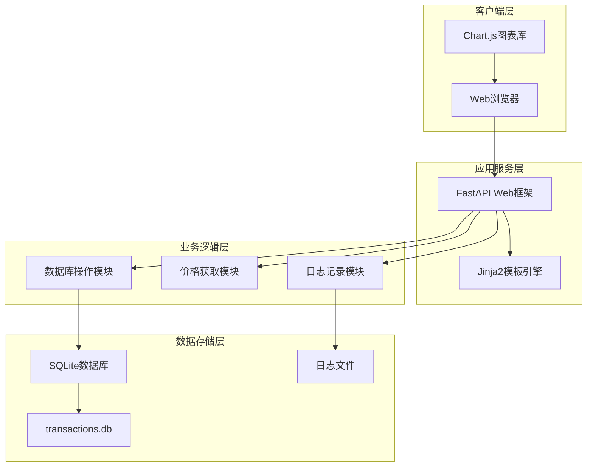
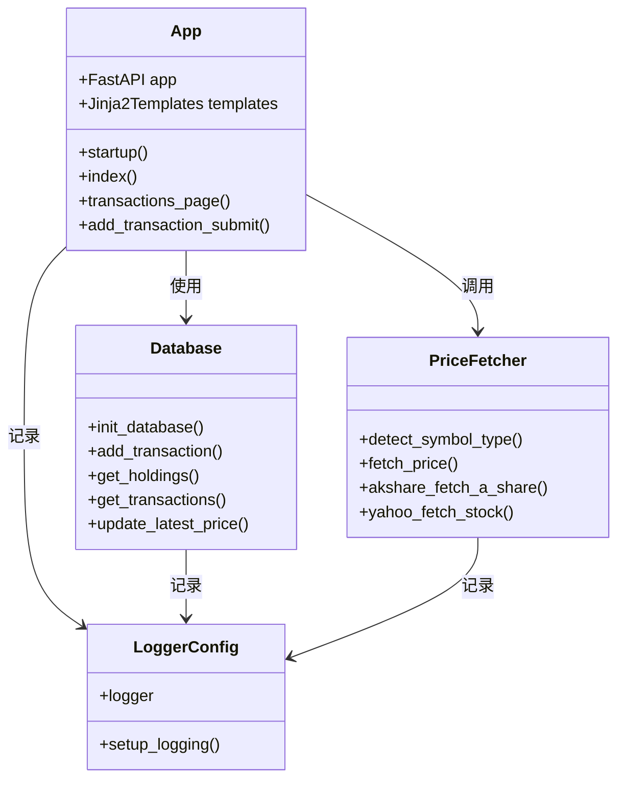
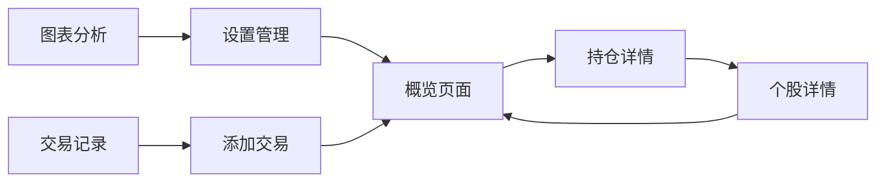
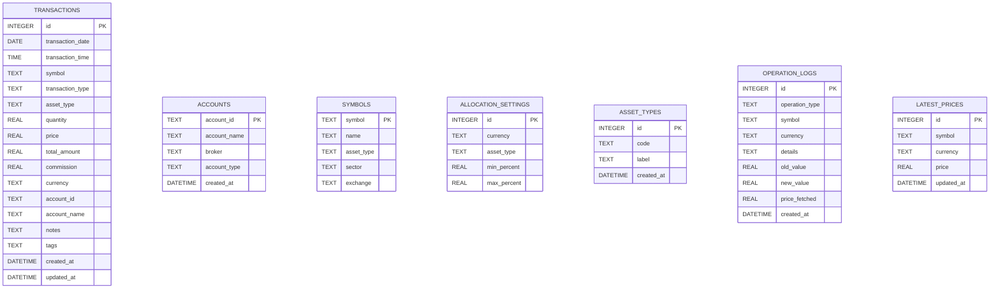
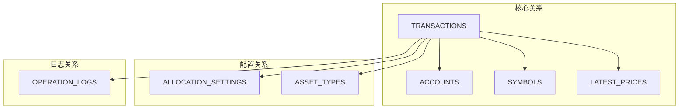

# 项目介绍

<cite>
**本文档引用的文件**
- [app.py](file://app.py)
- [database.py](file://database.py)
- [price_fetcher.py](file://price_fetcher.py)
- [requirements.txt](file://requirements.txt)
- [logger_config.py](file://logger_config.py)
- [templates/base.html](file://templates/base.html)
- [templates/index.html](file://templates/index.html)
- [templates/style.css](file://static/style.css)
- [templates/holdings.html](file://templates/holdings.html)
- [templates/transactions.html](file://templates/transactions.html)
</cite>

## 目录
1. [项目概述](#项目概述)
2. [核心功能特性](#核心功能特性)
3. [技术架构设计](#技术架构设计)
4. [用户界面设计](#用户界面设计)
5. [数据模型架构](#数据模型架构)
6. [应用场景与价值](#应用场景与价值)
7. [目标用户群体](#目标用户群体)
8. [独特优势分析](#独特优势分析)
9. [系统部署指南](#系统部署指南)
10. [总结](#总结)

## 项目概述

投资日志管理系统是一个基于Python开发的全栈Web应用程序，专为个人投资者提供全面的投资组合管理与分析解决方案。该系统通过现代化的技术架构，帮助用户高效地跟踪和管理各类投资资产，包括股票、债券、贵金属等多元化投资组合。

### 核心价值主张

本系统的核心价值在于为个人投资者提供一个**一站式**的投资管理平台，通过以下关键能力实现价值最大化：

- **多资产类别支持**：统一管理股票、债券、贵金属、现金等多种投资资产类型
- **实时价格追踪**：集成多个数据源，提供准确的实时市场价格
- **完整交易记录**：详细记录所有投资交易活动，支持多种交易类型
- **智能分析功能**：提供投资组合分析、收益计算、风险评估等高级功能
- **直观用户界面**：通过清晰的数据可视化和友好的交互设计提升用户体验

## 核心功能特性

### 1. 投资组合管理

系统提供全面的投资组合管理功能，包括：

- **多币种支持**：支持人民币(CNY)、美元(USD)、港币(HKD)三种货币
- **资产类型分类**：股票(stock)、债券(bond)、贵金属(metal)、现金(cash)
- **实时价值计算**：根据最新市场价格动态计算投资组合总价值
- **收益分析**：提供未实现收益、已实现收益的精确计算

### 2. 交易记录管理

系统支持完整的交易生命周期管理：

- **多样化交易类型**：买入(BUY)、卖出(SELL)、分红(DIVIDEND)、拆股(SPLIT)、转账(IN/OUT)、调整(ADJUST)
- **详细交易信息**：记录交易日期、数量、价格、手续费、账户等完整信息
- **历史追溯**：完整的交易历史记录，支持查询和审计

### 3. 实时价格获取

通过智能的价格获取机制，确保数据的准确性和时效性：

- **多数据源备份**：AKShare、Yahoo Finance、新浪、腾讯等多个数据源
- **智能切换**：当主要数据源不可用时自动切换到备用数据源
- **格式适配**：支持A股、港股、美股、黄金等多种资产类型的定价

### 4. 数据分析与可视化

提供丰富的数据分析和可视化功能：

- **投资组合分布图**：直观展示不同资产类别的占比情况
- **收益图表**：展示投资组合的历史收益变化趋势
- **配置分析**：基于用户设定的目标配置进行偏离度分析

## 技术架构设计

### 系统架构概览

**架构图来源**
- [app.py](file://app.py#L1-L50)
- [database.py](file://database.py#L1-L50)
- [price_fetcher.py](file://price_fetcher.py#L1-L30)

### 核心组件关系

系统采用模块化设计，各组件职责明确：

- **Web接口层**：基于FastAPI提供RESTful API和HTML页面服务
- **业务逻辑层**：封装复杂的业务规则和数据处理逻辑
- **数据访问层**：统一管理数据库连接和SQL操作
- **外部服务层**：集成第三方数据源和API服务

**组件关系图**

**类图来源**
- [app.py](file://app.py#L19-L444)
- [database.py](file://database.py#L20-L150)
- [price_fetcher.py](file://price_fetcher.py#L36-L63)

## 用户界面设计

### 导航架构

系统采用简洁直观的导航设计，提供清晰的功能分区：

**导航流程图**
- [templates/base.html](file://templates/base.html#L11-L21)

### 页面布局设计

系统采用响应式设计，适配不同设备屏幕：

- **概览页面**：展示投资组合的整体分布和配置情况
- **持仓详情**：提供详细的资产持有情况和收益分析
- **交易记录**：完整的交易历史列表，支持分页和删除操作
- **添加交易**：简洁的表单界面，支持快速录入交易信息
- **图表分析**：专业的数据分析界面，展示投资组合趋势

### 视觉设计特色

- **渐变色彩方案**：使用蓝色系为主色调，营造专业可靠的品牌形象
- **卡片式布局**：采用现代卡片设计，信息层次清晰
- **交互反馈**：提供丰富的用户操作反馈和状态提示
- **响应式适配**：完美适配桌面端和移动端设备

**视觉设计参考**
- [templates/style.css](file://static/style.css#L14-L44)
- [templates/style.css](file://static/style.css#L276-L376)

## 数据模型架构

### 数据库设计

系统采用SQLite作为数据存储后端，设计了完整的数据模型：

**数据模型图来源**
- [database.py](file://database.py#L25-L138)

### 关键数据表说明

1. **transactions表**：存储所有投资交易记录，是系统的核心数据表
2. **accounts表**：管理投资账户信息，支持多账户并行管理
3. **symbols表**：维护股票代码与公司名称的映射关系
4. **allocation_settings表**：存储用户设定的资产配置目标范围
5. **asset_types表**：定义可使用的资产类型及其标签
6. **operation_logs表**：记录系统重要操作的日志信息
7. **latest_prices表**：缓存最新的市场价格数据

### 数据关系设计

系统通过合理的外键约束和索引设计，确保数据的一致性和查询性能：

- **主键设计**：所有表都使用自增主键，确保数据唯一性
- **索引优化**：为常用查询字段建立索引，提升查询效率
- **约束检查**：通过CHECK约束确保数据的有效性和完整性

**数据关系图**

## 应用场景与价值

### 个人投资者应用场景

#### 1. 多元化投资组合管理
- **场景描述**：个人投资者同时持有股票、债券、贵金属等多种资产
- **系统价值**：提供统一的管理界面，实时跟踪各类资产的表现
- **功能体现**：支持多币种、多资产类型的统一估值和收益计算

#### 2. 跨市场投资追踪
- **场景描述**：投资者在A股、港股、美股市场都有投资
- **系统价值**：通过多数据源整合，提供准确的全球市场数据
- **功能体现**：智能识别不同市场的投资标的，自动获取对应价格

#### 3. 长期投资策略分析
- **场景描述**：投资者关注长期投资回报和资产配置优化
- **系统价值**：提供详细的历史交易记录和收益分析功能
- **功能体现**：支持按年份、季度等时间维度进行收益分析

### 专业理财应用场景

#### 1. 投资顾问服务
- **场景描述**：理财顾问需要管理多个客户的投资组合
- **系统价值**：提供标准化的投资管理工具，提升服务效率
- **功能体现**：支持多账户管理，详细的投资分析报告

#### 2. 家庭财富管理
- **场景描述**：家庭需要统一管理各种金融资产
- **系统价值**：提供透明的投资追踪和分析功能
- **功能体现**：支持家庭成员间的资产分配和收益共享

## 目标用户群体

### 主要用户群体

#### 1. 个人投资者
- **特征**：有一定投资经验，希望有效管理自己的投资组合
- **需求**：需要简单易用的投资管理工具，能够提供基本的分析功能
- **使用场景**：日常查看投资组合表现，记录交易活动

#### 2. 新手投资者
- **特征**：刚开始接触投资，需要学习和实践相结合
- **需求**：需要直观的操作界面和基础的投资指导
- **使用场景**：学习投资知识，记录投资过程

#### 3. 专业投资者
- **特征**：有丰富投资经验，需要专业的分析工具
- **需求**：需要详细的数据分析和高级功能
- **使用场景**：深度分析投资组合，制定投资策略

### 用户技能要求

系统设计考虑了不同技术水平用户的需求：

- **入门级用户**：通过简单的界面操作即可完成基本功能
- **中级用户**：可以利用更详细的功能进行深入分析
- **高级用户**：可以利用API接口进行自动化集成

## 独特优势分析

### 技术优势

#### 1. 多数据源价格获取
系统集成了多个权威数据源，提供可靠的价格数据：

- **AKShare**：国内主要的金融数据获取库，支持A股、港股、美股数据
- **Yahoo Finance**：国际知名金融数据提供商，数据质量高
- **新浪/腾讯**：国内主流财经网站，提供实时市场数据

#### 2. 智能错误处理
系统具备完善的错误处理机制：

- **自动降级**：当主要数据源失效时自动切换到备用数据源
- **详细日志**：完整的操作日志，便于问题排查和审计
- **用户反馈**：及时向用户反馈操作结果和错误信息

#### 3. 响应式设计
系统采用现代化的前端技术：

- **移动友好**：完美适配手机和平板设备
- **加载优化**：通过懒加载和缓存机制提升页面加载速度
- **交互体验**：流畅的用户交互和即时的状态反馈

### 功能优势

#### 1. 全面的资产管理
系统支持多种资产类型和交易方式：

- **资产类型**：股票、债券、贵金属、现金等
- **交易类型**：买入、卖出、分红、拆股、转账等
- **货币支持**：人民币、美元、港币三币种支持

#### 2. 深度分析功能
提供专业的投资分析工具：

- **收益计算**：自动计算未实现收益和已实现收益
- **配置分析**：基于用户目标配置进行偏离度分析
- **趋势预测**：通过历史数据进行简单的趋势分析

#### 3. 用户友好设计
系统注重用户体验：

- **简洁界面**：避免复杂的专业术语，提供直观的操作界面
- **智能提示**：通过颜色和图标提供视觉化的信息传达
- **个性化设置**：允许用户根据自己的需求调整界面和功能

### 性能优势

#### 1. 高效的数据处理
系统采用优化的数据处理策略：

- **批量操作**：支持批量导入和导出功能
- **增量更新**：只更新发生变化的数据，减少系统负载
- **缓存机制**：对频繁访问的数据进行缓存，提升响应速度

#### 2. 可扩展性设计
系统具备良好的可扩展性：

- **模块化架构**：各个功能模块相对独立，便于扩展和维护
- **插件机制**：预留了扩展新功能的接口
- **配置驱动**：通过配置文件控制功能开关和行为

## 系统部署指南

### 环境要求

系统基于Python开发，具有较低的部署门槛：

- **Python版本**：Python 3.7或更高版本
- **操作系统**：Windows、macOS、Linux均可运行
- **内存要求**：建议至少2GB RAM
- **存储空间**：根据数据量大小而定，建议至少100MB可用空间

### 依赖安装

系统使用pip进行依赖管理，安装过程简单快捷：

1. **克隆项目**：`git clone https://github.com/your-repo/invest-log.git`
2. **进入目录**：`cd invest-log`
3. **安装依赖**：`pip install -r requirements.txt`
4. **启动应用**：`python app.py`

### 配置选项

系统支持灵活的配置选项：

- **数据库路径**：默认使用本地SQLite数据库
- **日志配置**：自动创建日志目录和文件
- **静态资源**：CSS样式文件位于static目录下

### 运行方式

系统支持多种运行模式：

- **开发模式**：使用uvicorn直接运行，支持热重载
- **生产模式**：推荐使用uwsgi或gunicorn等WSGI服务器
- **Docker部署**：可通过Docker容器化部署

## 总结

投资日志管理系统是一个功能完善、设计精良的个人投资管理工具。通过现代化的技术架构和用户友好的界面设计，系统为个人投资者提供了全面的投资组合管理解决方案。

### 核心价值总结

1. **简化投资管理**：通过统一的平台简化多资产、多账户的管理复杂度
2. **提升决策质量**：提供准确的数据和分析工具，辅助投资决策
3. **降低管理成本**：开源免费的解决方案，降低个人投资者的管理成本
4. **增强投资透明度**：完整的交易记录和实时价格追踪，提升投资透明度

### 发展前景

随着个人投资者数量的增长和投资意识的提升，这类投资管理工具具有广阔的发展前景。系统已经具备了坚实的基础，未来可以在以下方面进一步完善：

- **移动端应用**：开发原生移动应用，提供更好的移动体验
- **云端同步**：支持多设备间的数据同步和备份
- **AI辅助分析**：引入人工智能技术，提供智能化的投资建议
- **社交功能**：增加投资社区功能，促进投资者间的交流学习

投资日志管理系统不仅是一个实用的投资工具，更是个人投资者数字化转型的重要助手。通过持续的功能完善和技术升级，系统必将成为个人投资者不可或缺的得力助手。