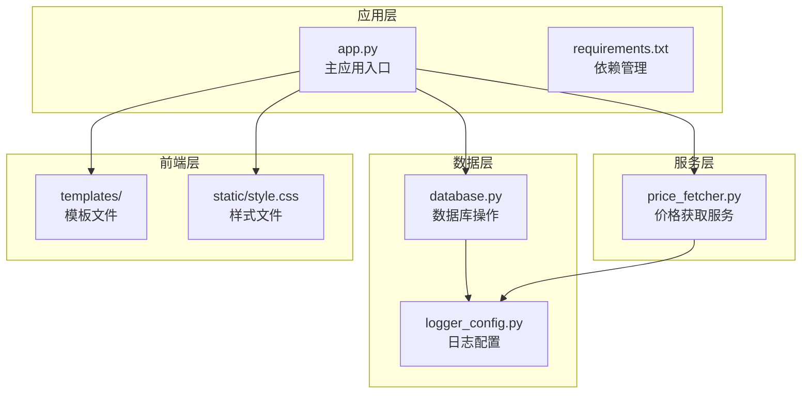
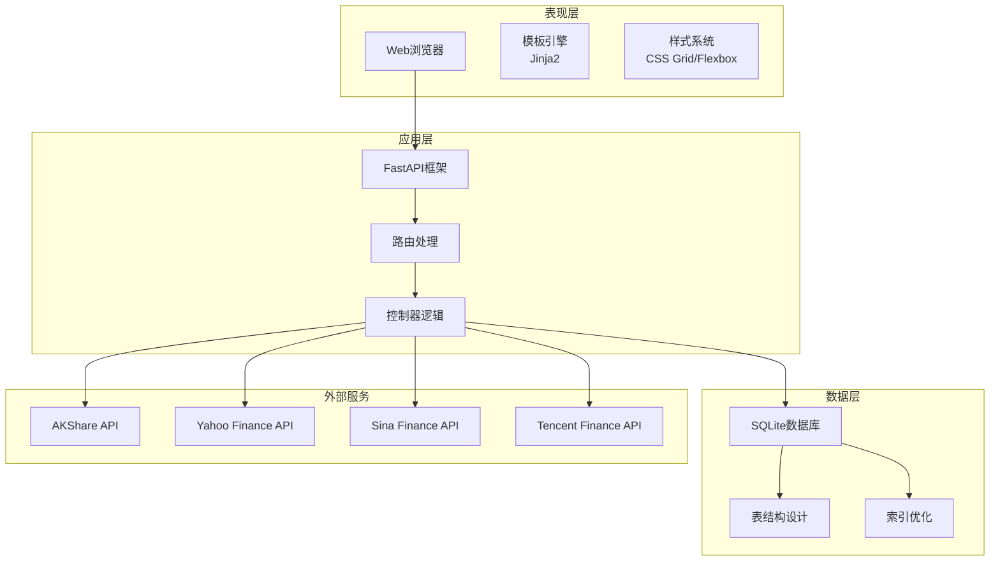
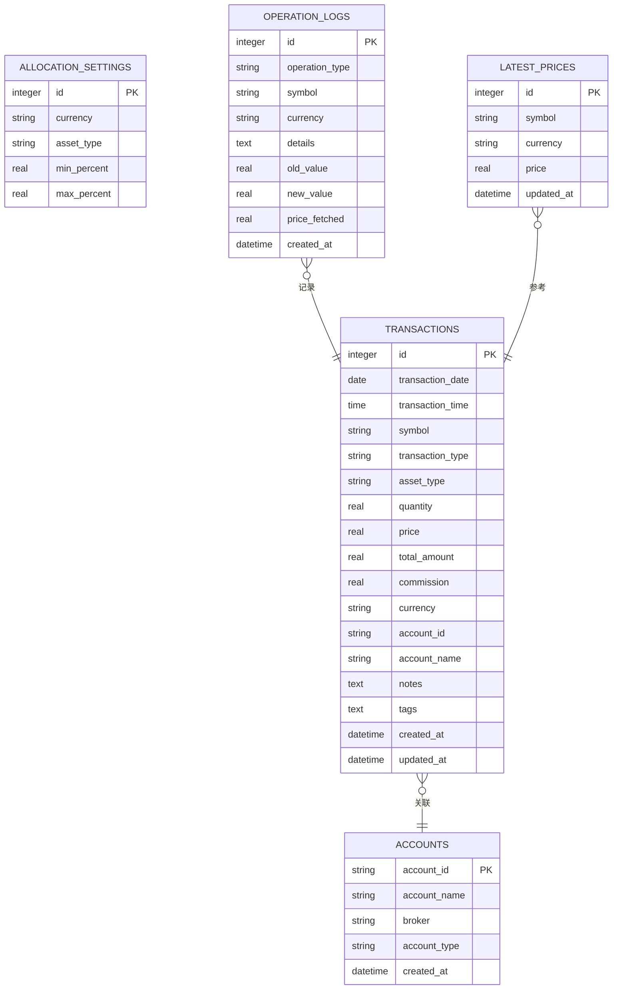
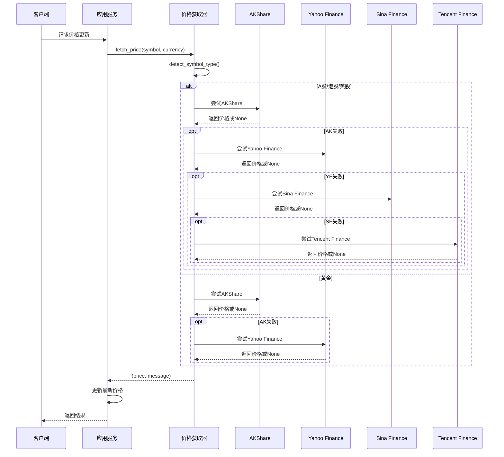
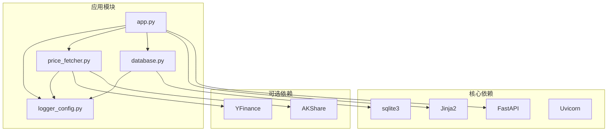
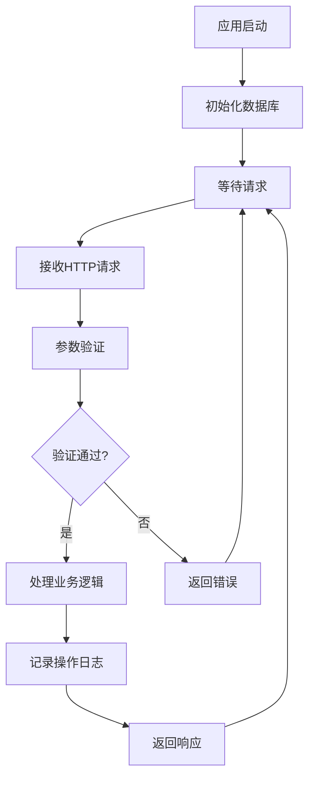

# 项目概述

<cite>
**本文档引用的文件**
- [app.py](file://app.py)
- [database.py](file://database.py)
- [price_fetcher.py](file://price_fetcher.py)
- [logger_config.py](file://logger_config.py)
- [requirements.txt](file://requirements.txt)
- [templates/base.html](file://templates/base.html)
- [templates/index.html](file://templates/index.html)
- [static/style.css](file://static/style.css)
</cite>

## 目录
1. [简介](#简介)
2. [项目结构](#项目结构)
3. [核心组件](#核心组件)
4. [架构概览](#架构概览)
5. [详细组件分析](#详细组件分析)
6. [依赖关系分析](#依赖关系分析)
7. [性能考虑](#性能考虑)
8. [故障排除指南](#故障排除指南)
9. [结论](#结论)

## 简介

投资日志管理系统是一个基于FastAPI的全栈Web应用程序，专为个人投资者设计，用于管理和分析投资组合。该系统提供了完整的交易记录管理、实时价格追踪和投资组合分析功能，帮助用户全面掌握自己的财务状况。

### 主要目标

- **交易记录管理**：完整记录和跟踪各类金融产品的买卖、分红、拆分等交易活动
- **实时价格追踪**：集成多数据源获取实时市场价格，支持A股、港股、美股和黄金等资产类别
- **投资组合分析**：提供多维度的投资组合分析，包括资产配置、收益分析和风险评估
- **数据持久化**：使用SQLite数据库确保数据安全存储和快速访问

### 核心功能特性

- **多货币支持**：支持人民币(CNY)、美元(USD)、港币(HKD)三种货币的投资记录
- **多资产类型**：涵盖股票(stock)、债券(bond)、贵金属(metal)、现金(cash)四大类资产
- **动态资产类型管理**：允许用户自定义和管理资产类型
- **配置范围设置**：支持为不同货币和资产类型设置投资配置范围
- **操作日志记录**：完整记录所有关键操作，便于审计和问题排查

## 项目结构

该项目采用模块化的文件组织方式，清晰分离了业务逻辑、数据访问层和前端展示层：



**图表来源**
- [app.py](file://app.py#L1-L50)
- [database.py](file://database.py#L1-L50)
- [price_fetcher.py](file://price_fetcher.py#L1-L50)
- [logger_config.py](file://logger_config.py#L1-L50)

### 文件组织说明

- **根目录文件**：应用入口、数据库操作、价格获取和日志配置
- **templates目录**：Jinja2模板文件，负责页面渲染
- **static目录**：静态资源文件，包括CSS样式和JavaScript
- **日志目录**：运行时生成的日志文件

**章节来源**
- [app.py](file://app.py#L1-L50)
- [requirements.txt](file://requirements.txt#L1-L6)

## 核心组件

### 应用程序核心

应用采用FastAPI框架构建，提供了高性能的异步Web服务。核心组件包括路由定义、模板渲染、静态文件服务和数据库初始化。

### 数据库层

数据库层实现了完整的CRUD操作，支持复杂的查询和聚合分析。主要表结构包括：
- **transactions**：交易记录表，存储所有买卖、分红等交易活动
- **accounts**：账户信息表，管理投资账户详情
- **allocation_settings**：配置设置表，存储资产配置范围
- **operation_logs**：操作日志表，记录所有重要操作
- **latest_prices**：最新价格表，缓存实时市场数据

### 价格获取服务

价格获取服务集成了多个数据源，提供可靠的价格数据：
- **AKShare**：主要数据源，支持A股、港股、美股和黄金
- **Yahoo Finance**：备用数据源，提供美股和部分港股数据
- **新浪/腾讯API**：本地备份数据源，确保数据可用性

**章节来源**
- [app.py](file://app.py#L19-L30)
- [database.py](file://database.py#L25-L149)
- [price_fetcher.py](file://price_fetcher.py#L1-L50)

## 架构概览

系统采用经典的三层架构模式，结合现代Web开发的最佳实践：



**图表来源**
- [app.py](file://app.py#L7-L23)
- [database.py](file://database.py#L13-L18)
- [price_fetcher.py](file://price_fetcher.py#L23-L34)

### 技术栈选择

#### FastAPI的优势
- **高性能**：基于Starlette和Pydantic，提供卓越的性能表现
- **自动文档**：内置Swagger UI和ReDoc文档生成
- **类型安全**：通过Pydantic模型确保数据验证和序列化
- **异步支持**：原生支持异步编程，提高并发处理能力

#### Jinja2模板引擎
- **灵活性**：支持模板继承和块定义，便于维护统一的界面风格
- **易用性**：语法简单直观，降低前端开发复杂度
- **性能**：编译后的模板具有良好的执行效率

#### SQLite数据库
- **轻量级**：无需独立服务器进程，部署简单
- **可靠性**：ACID事务支持，确保数据完整性
- **跨平台**：支持多种操作系统，便于移植
- **内建索引**：自动优化查询性能

#### 多数据源策略
- **冗余保障**：多个数据源相互备份，提高系统稳定性
- **地域覆盖**：针对不同市场的数据源优化
- **容错机制**：自动降级和错误处理

**章节来源**
- [requirements.txt](file://requirements.txt#L1-L6)
- [app.py](file://app.py#L7-L23)

## 详细组件分析

### 应用路由系统

应用定义了完整的路由体系，涵盖了从基础页面到API接口的所有功能：

```mermaid
graph LR
subgraph "页面路由"
HOME[/ - 首页仪表板]
HOLDINGS[/holdings - 持仓详情]
TRANSACTIONS[/transactions - 交易列表]
ADD[/add - 添加交易]
CHARTS[/charts - 图表分析]
SYMBOL[/symbol/{symbol} - 标的详情]
SETTINGS[/settings - 设置管理]
end
subgraph "API路由"
API_HOLDINGS[/api/holdings - 持仓查询]
API_TRANSACTIONS[/api/transactions - 交易查询]
API_HISTORY[/api/portfolio-history - 历史数据]
API_DELETE[/api/transactions/{id} - 删除交易]
end
HOME --> API_HOLDINGS
HOLDINGS --> API_HOLDINGS
TRANSACTIONS --> API_TRANSACTIONS
CHARTS --> API_HISTORY
SYMBOL --> API_TRANSACTIONS
```

**图表来源**
- [app.py](file://app.py#L36-L188)
- [app.py](file://app.py#L376-L439)

### 数据库设计模式

数据库采用了规范化的表结构设计，支持复杂的投资组合分析：



**图表来源**
- [database.py](file://database.py#L25-L149)

### 价格获取流程

价格获取服务实现了智能的数据源选择和降级机制：



**图表来源**
- [price_fetcher.py](file://price_fetcher.py#L321-L394)
- [app.py](file://app.py#L216-L261)

**章节来源**
- [app.py](file://app.py#L36-L188)
- [database.py](file://database.py#L25-L149)
- [price_fetcher.py](file://price_fetcher.py#L321-L394)

## 依赖关系分析

系统采用松耦合的设计原则，各组件间通过明确定义的接口进行交互：



**图表来源**
- [requirements.txt](file://requirements.txt#L1-L6)
- [app.py](file://app.py#L7-L17)

### 组件耦合度分析

- **低耦合高内聚**：每个模块职责明确，内部逻辑紧密相关
- **接口清晰**：数据库操作通过函数接口暴露，便于测试和替换
- **配置驱动**：通过常量和配置文件管理全局设置
- **异常处理**：统一的日志记录机制确保问题可追踪

**章节来源**
- [requirements.txt](file://requirements.txt#L1-L6)
- [app.py](file://app.py#L7-L17)

## 性能考虑

### 数据库优化策略

- **索引优化**：为常用查询字段建立索引，包括symbol、transaction_date、account_id等
- **查询优化**：使用参数化查询防止SQL注入，避免N+1查询问题
- **连接池**：通过row_factory优化数据访问性能
- **缓存策略**：latest_prices表缓存最新价格，减少重复网络请求

### Web服务优化

- **异步处理**：利用FastAPI的异步特性提高并发处理能力
- **静态资源**：通过StaticFiles提供高效的静态文件服务
- **模板渲染**：Jinja2模板预编译，减少模板解析开销
- **响应压缩**：支持Gzip压缩减少传输数据量

### 数据获取优化

- **超时控制**：为外部API调用设置合理的超时时间
- **重试机制**：对临时性错误提供自动重试
- **降级策略**：当主要数据源不可用时自动切换到备用源
- **批量处理**：支持批量价格更新和批量交易查询

## 故障排除指南

### 常见问题诊断

#### 数据库连接问题
- **症状**：应用启动时报数据库连接错误
- **原因**：SQLite文件权限不足或数据库损坏
- **解决方案**：检查文件权限，重新初始化数据库

#### 价格获取失败
- **症状**：价格更新按钮点击无响应或显示错误信息
- **原因**：网络连接问题或数据源API限制
- **解决方案**：检查网络连接，查看日志文件获取详细错误信息

#### 页面加载缓慢
- **症状**：页面响应时间过长
- **原因**：数据库查询未使用索引或数据量过大
- **解决方案**：优化查询条件，考虑分页或缓存策略

### 日志分析

系统提供了完善的日志记录机制，便于问题诊断：



**图表来源**
- [logger_config.py](file://logger_config.py#L14-L53)

**章节来源**
- [logger_config.py](file://logger_config.py#L14-L53)

## 结论

投资日志管理系统是一个设计精良的全栈Web应用程序，成功地将现代Web开发技术与金融数据管理需求相结合。系统具有以下显著优势：

### 技术优势
- **现代化技术栈**：FastAPI提供高性能和类型安全，Jinja2确保良好的用户体验
- **稳健的架构设计**：清晰的分层架构和模块化设计便于维护和扩展
- **可靠的性能表现**：优化的数据库设计和缓存策略确保系统高效运行
- **完善的错误处理**：全面的日志记录和异常处理机制

### 功能特色
- **全面的投资管理**：从交易记录到价格追踪的完整解决方案
- **灵活的配置选项**：支持多货币、多资产类型的个性化配置
- **智能的数据获取**：多数据源备份确保价格数据的准确性和可用性
- **直观的可视化**：基于Chart.js的图表展示，帮助用户更好地理解投资组合

### 发展前景
该系统为个人投资者提供了一个专业级的投资管理工具，具备良好的扩展性和维护性。未来可以考虑添加更多高级功能，如投资组合优化建议、税务计算、多用户支持等，进一步提升系统的实用价值。